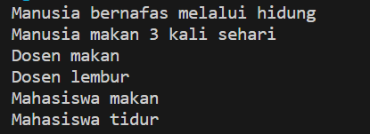

# Jobsheet 9 Overloading dan Overriding

NIM : 2241720139

Nama : Najwa Azzahra

Kelas : TI-2C/20

## Percobaan 1

**Class Karyawan**

```java
   public class Karyawan {
    
    private String nama;
    private String nip;
    private String golongan;
    private double gaji;

    public void setNama (String nama) {
        this.nama=nama;
    }

    public void setNip (String nip) {
        this.nip=nip;
    }

    public void setGolongan (String golongan) {
        this.golongan=golongan;
        switch (golongan.charAt(0)) {
            case '1':this.gaji=5000000;
                break;
            case '2':this.gaji=3000000;
                break;
            case '3':this.gaji=2000000;
                break;
            case '4':this.gaji=1000000;
                break;
            case '5':this.gaji=750000;
                break;
        }
    }
    
    public void setGaji (double gaji) {
        this.gaji=gaji;
    }

    public String getNama () {
        return nama;
    }

    public String getNip () {
        return nip;
    }

    public String getGolongan () {
        return golongan;
    }

    public double getGaji () {
        return gaji;
    }
}
```

**Class Staff**

```java
   public class Staff extends Karyawan{

    private int lembur;
    private double gajiLembur;

    public void setLembur(int lembur) {
        this.lembur=lembur;
    }

    public int getLembur() {
        return lembur;
    }

    public void setGajiLembur(double gajiLembur) {
        this.gajiLembur=gajiLembur;
    }

    public double getGajiLembur() {
        return gajiLembur;
    }

    //overloading
    public double getGaji(int lembur, double gajiLembur) {
        return super.getGaji()+lembur*gajiLembur;
    }

    public double getGaji() {
        return super.getGaji()+lembur*gajiLembur;
    }

    public void lihatInfo() {
        System.out.println("NIP\t\t: "+this.getNip());
        System.out.println("Nama\t\t: "+this.getNama());
        System.out.println("Golongan\t: "+this.getGolongan());
        System.out.println("Jumlah Lembur\t: "+this.getLembur());
        System.out.printf("Gaji Lembur\t: %.0f\n", this.getGajiLembur());
        System.out.printf("Gaji\t\t: %.0f\n", this.getGaji());
    }
}
```

**Class Manager**

```java
   public class Manager extends Karyawan {

    private double tunjangan;
    private String bagian;
    private Staff st[];

    public void setTunjangan(double tunjangan) {
        this.tunjangan=tunjangan;
    }

    public double getTunjangan() {
        return tunjangan;
    }

    public void setBagian(String bagian) {
        this.bagian=bagian;
    }

    public String getBagian() {
        return bagian;
    }

    public void setStaff(Staff st[]) {
        this.st=st;
    }

    public void viewStaff(){
        int i;
        System.out.println("---------------------------------------");
        for (i=0;i<st.length;i++){
            st[i].lihatInfo();
        }

        System.out.println("---------------------------------------");
    }


    //overriding
    public void lihatInfo() {
        System.out.println("Manager\t\t: "+this.getBagian());
        System.out.println("NIP\t\t: "+this.getNip());
        System.out.println("Nama\t\t: "+this.getNama());
        System.out.println("Golongan\t: "+this.getGolongan());
        System.out.printf("Tunjangan\t: %.0f\n", this.getTunjangan());
        System.out.printf("Gaji\t\t: %.0f\n", this.getGaji());
        System.out.println("Bagian\t\t: "+this.getBagian());
        this.viewStaff();
    }

    public double getGaji() {
        return super.getGaji()+tunjangan;
    }
}
```

**Class Utama**

```java
   public class Utama {

    public static void main(String[] args) {
        System.out.println("Program Testing Class Manager & Staff");
        Manager man[]=new Manager[2];
        Staff staff1[] = new Staff[2];
        Staff staff2[] = new Staff[3];

        //pembuatan manager

        man[0]=new Manager();
        man[0].setNama("Tedjo");
        man[0].setNip("101");
        man[0].setGolongan("1");
        man[0].setTunjangan(5000000);
        man[0].setBagian("Administrasi");

        man[1]=new Manager();
        man[1].setNama("Atika");
        man[1].setNip("102");
        man[1].setGolongan("1");
        man[1].setTunjangan(2500000);
        man[1].setBagian("Pemasaran");

        staff1[0]=new Staff();
        staff1[0].setNama("Usman");
        staff1[0].setNip("0003");
        staff1[0].setGolongan("2");
        staff1[0].setLembur(10);
        staff1[0].setGajiLembur(10000);

        staff1[1]=new Staff();
        staff1[1].setNama("Anugrah");
        staff1[1].setNip("0005");
        staff1[1].setGolongan("2");
        staff1[1].setLembur(10);
        staff1[1].setGajiLembur(55000);
        man[0].setStaff(staff1);

        staff2[0]=new Staff();
        staff2[0].setNama("Hendra");
        staff2[0].setNip("0004");
        staff2[0].setGolongan("3");
        staff2[0].setLembur(15);
        staff2[0].setGajiLembur(5500);

        staff2[1]=new Staff();
        staff2[1].setNama("Arie");
        staff2[1].setNip("0006");
        staff2[1].setGolongan("4");
        staff2[1].setLembur(5);
        staff2[1].setGajiLembur(100000);

        staff2[2]=new Staff();
        staff2[2].setNama("Mentari");
        staff2[2].setNip("0007");
        staff2[2].setGolongan("3");
        staff2[2].setLembur(6);
        staff2[2].setGajiLembur(20000);
        man[1].setStaff(staff2);

        //cetak informasi dari manager + staffnya
        man[0].lihatInfo();
        man[1].lihatInfo();
    }
}
```

**Output**


### Latihan

**PerkalianKu**

```java
public class PerkalianKu {

    //overloading
    void perkalian(int a, int b) {
        System.out.println(a * b);
    }

    void perkalian(int a, int b, int c) {
        System.out.println(a * b * c);
    }

    public static void main(String[] args) {
        PerkalianKu objek = new PerkalianKu();

        objek.perkalian(25, 43);
        objek.perkalian(34, 23, 56);
    }
}
```

**Output**


1. Dari source coding diatas terletak dimanakah overloading?
   **Jawaban**
   
   Pada method perkalian, method tersebut memiliki nama yang sama (perkalian), tetapi jumlah parameter berbeda. 
   Yang pertama menerima dua parameter (int a dan int b), sedangkan yang kedua menerima tiga parameter (int a, int b, dan int c). 

2. Jika terdapat overloading ada berapa jumlah parameter yang berbeda?

   **Jawaban**

   Ada dua method perkalian dengan jumlah parameter yang berbeda: 
   satu dengan dua parameter (int a dan int b) 
   dan yang lainnya dengan tiga parameter (int a, int b, int c). 
   Jadi dalam contoh ini, jumlah parameter yang berbeda adalah dua.


**PerkalianKu**

```java
public class PerkalianKu {

    //overloading
    void perkalian(int a, int b) {
        System.out.println(a * b);
    }

    void perkalian(double a, double b) {
        System.out.println(a * b);
    }

    public static void main(String[] args) {
        PerkalianKu objek = new PerkalianKu();

        objek.perkalian(25, 43);
        objek.perkalian(34.56, 23.7);
    }
}
```

**Output**


3. Dari source coding diatas terletak dimanakah overloading?

   **Jawaban**
    
   Pada method perkalian, method tersebut memiliki nama yang sama (perkalian), tetapi tipe data parameter berbeda. 
   Yang pertama menerima dua parameter dengan tipe data integer (int a dan int b), sedangkan yang kedua menerima dua parameter dengan tipe data double (double a, double b). 

4. Jika terdapat overloading ada berapa tipe parameter yang berbeda?

   **Jawaban**

   Ada dua method perkalian dengan jumlah parameter yang berbeda: 
   satu dengan parameter integer (int a dan int b) 
   dan yang lainnya dengan parameter double (double a, double b)
   Jadi dalam contoh ini, terdapat dua tipe parameter yang berbeda yaitu int dan double

**Ikan**

```java
public class Ikan {
    public void swim() {
        System.out.println("Ikan bisa berenang");
    }
}
```

**Piranha**

```java
public class Piranha extends Ikan{

    //overriding
    public void swim() {
        System.out.println("Piranha bisa makan daging");
    }
}
```

**Fish**

```java
public class Fish {

    public static void main(String[] args) {
        Ikan a = new Ikan();
        Ikan b = new Piranha();

        a.swim();
        b.swim();
    }
}
```

**Output**


5. Dari source coding diatas terletak dimanakah overriding?

   **Jawaban**

   Terletak pada method swim, karena method tersebut terdapat pada superclass dan subclass dengan bentuk eksekusi yang berbeda

6. Jabarkanlah apabila sourcoding diatas jika terdapat overriding?

   **Jawaban**

   Class Ikan adalah superclass dari class Piranhan, dan kedua class tersebut memiliki method yang sama yaitu swim. Namun bentuk eksekusinya berbeda, sehingga daoat dikatakan overriding


### Tugas

1. Overloading

   **Class Segitiga**

   ```java
    public class Segitiga {

    private int sudut;

    public int totalSudut(int sudutA) {
        sudut = 180 - sudutA;
        return sudut;
    }

    public int totalSudut(int sudutA, int sudutB) {
        sudut = 180 - (sudutA + sudutB);
        return sudut;
    }

    public int keliling(int sisiA, int sisiB, int sisiC) {
        int keliling = sisiA + sisiB + sisiC;
        return keliling;
    }

    public double keliling(int sisiA, int sisiB) {
        double c = Math.sqrt(sisiA * sisiA + sisiB * sisiB);
        return c;
    }

    public static void main(String[] args) {
        Segitiga s1 = new Segitiga();
        Segitiga s2 = new Segitiga();

        System.out.println("===========Menghitung Sudut dan Keliling Segitiga===========");

        System.out.println("Total sudut segitiga 1\t: " + s1.totalSudut(68));
        System.out.println("Total sudut segitiga 2\t: " + s2.totalSudut(45, 27));

        System.out.println("Keliling segitiga 1\t: "+s1.keliling(7, 9));
        System.out.println("Keliling segitiga 2\t: "+s1.keliling(6, 12, 10));

        } 
    }
   ```


   **Output**

   


2. Overriding

   **Class Manusia**

   ```java
    public class Manusia {

    public void bernafas() {
        System.out.println("Manusia bernafas melalui hidung");
    }

    public void makan() {
        System.out.println("Manusia makan 3 kali sehari");
    } 
    }

   ```

   **Class Dosen**

   ```java
    public class Dosen extends Manusia {

    public void makan() {
        System.out.println("Dosen makan");
    }

    public void lembur() {
        System.out.println("Dosen lembur");
    }
    }
   ```

   **Class Mahasiswa**

   ```java
    public class Mahasiswa extends Manusia{

    public void makan() {
        System.out.println("Mahasiswa makan");
    }

    public void tidur() {
        System.out.println("Mahasiswa tidur");
    }
    }
   ```

   **Class TestOverriding**

   ```java
    public class TestOverriding {

    public static void main(String[] args) {
        Manusia man = new Manusia();
        Dosen dos = new Dosen();
        Mahasiswa mhs= new Mahasiswa();

        //class manusia
        man.bernafas();
        man.makan();

        //class dosen
        dos.makan();
        dos.lembur();

        //class mahasiswa
        mhs.makan();
        mhs.tidur();
    }
    }
   ```

   **Output**

   
