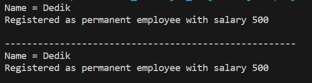
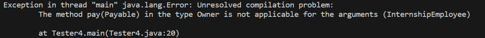

# Jobsheet 12 Polimorfisme

NIM : 2241720139

Nama : Najwa Azzahra

Kelas : TI-2C/20

## Percobaan 1

**Class Employee**

```java
public class Employee {

    protected String name;

    public String getEmployeeInfo() {
        return "Name = " + name;
    }
}
```

**Interface Payable**

```java
public interface Payable {

    public int getPaymentAmount();
}
```

**Class InternshipEmployee**

```java
public class InternshipEmployee extends Employee{
    private int length;

    public InternshipEmployee (String name, int length) {
        this.length=length;
        this.name=name;
    }

    public int getLength() {
        return length;
    }

    public void setLength(int length) {
        this.length=length;
    }
    
    @Override
    public String getEmployeeInfo() {
        String info = super.getEmployeeInfo()+"\n";
        info += "Registered as internship employee for " + length + " month/s\n";
        return info; 
    }
}
```

**Class PermanentEmployee**

```java
public class PermanentEmployee extends Employee implements Payable {
    private int salary;

    public PermanentEmployee(String name, int salary) {
        this.name=name;
        this.salary=salary;
    }

    public int getSalary() {
        return salary;
    }

    public void setSalary(int salary) {
        this.salary=salary;
    }

    @Override
    public int getPaymentAmount() {
        return (int) (salary+0.05*salary);
    }

    @Override
    public String getEmployeeInfo() {
        String info = super.getEmployeeInfo()+"\n";
        info += "Registered as permanent employee with salary " + salary + "\n";
        return info;
    }

    
}
```

**Class ElectricityBill**

```java
public class ElectricityBill implements Payable{

    private int kwh;
    private String category;

    public ElectricityBill(int kwh, String category) {
        this.kwh = kwh;
        this.category = category;
    }

    public int getKwh() {
        return kwh;
    }

    public void setKwh(int kwh) {
        this.kwh=kwh;
    }

    public String getCategory() {
        return category;
    }

    public void setCategory(String category) {
        this.category=category;
    }

    @Override
    public int getPaymentAmount() {
        return kwh*getBasePrice();
    }

    public int getBasePrice() {
        int bPrice = 0;
        switch (category) {
            case "R-1": bPrice = 100; break;
            case "R-2": bPrice = 200; break;       
        }
        return bPrice;
    }

    public String getBillInfo() {
        return "kwH = "+kwh+"\n"+"Category = " + category + "(" + getBasePrice()+" per kwH)\n";
    }
}
```


**Class Tester**

```java
public class Tester1 {
    public static void main(String[] args) {
        PermanentEmployee pEmp = new PermanentEmployee("Dedik", 500);
        InternshipEmployee iEmp = new InternshipEmployee("Sunarto", 5);
        ElectricityBill eBill = new ElectricityBill(5, "A-1");

        Employee e;
        Payable p;
        e=pEmp;
        e=iEmp;
        p=pEmp;
        p=eBill;
    }
    
}
```

**Output**

Kode program yang telah diberikan tidak menghasilkan output karena dalam class Tester1 hanya melakukan pembuatan objek tanpa melakukan operasi apa pun seperti memanggil metode atau menampilkan informasi dari objek-objek yang telah dibuat.

### Pertanyaan

1. Class apa sajakah yang merupakan turunan dari class Employee?

   **Jawaban**
   
   - Class InternshipEmployee
   - Class PermanentEmployee

2. Class apa sajakah yang implements ke interface Payable?

   **Jawaban**

   - Class ElectricityBill
   - Class PermanentEmployee

3. Perhatikan class Tester1, baris ke-10 dan 11. Mengapa e, bisa diisi dengan objek pEmp (merupakan objek dari class PermanentEmployee) dan objek iEmp (merupakan objek dari class InternshipEmploye) ?

   **Jawaban**

   karena objek pEmp merepresentasikan class PermanentEmployee dan objek iEmp merepresentasikan class InternshipEmployee yang merupakan subclass dari class Employee yang dituliskan sebagai objek e

4. Perhatikan class Tester1, baris ke-12 dan 13. Mengapa p, bisa diisi dengan objekpEmp (merupakan objek dari class PermanentEmployee) dan objek eBill (merupakan objek dari class ElectricityBill) ?


   **Jawaban**

   karena objek pEmp merepresentasikan class PermanentEmployee dan objek eBill merepresentasikan class ElectricityBill yang mana kedua class tersebut mengimplementasikan interface Payable. 

5. Coba tambahkan sintaks:
p = iEmp;
e = eBill;
pada baris 14 dan 15 (baris terakhir dalam method main) ! Apa yang menyebabkan error?

   **Output**

   

   **Jawaban**

   Terjadi error karena class InternshipEmployee tidak mengimplementasikan interface payable dan class ElectricityBill bukan subclass dari class Employee.

6. Ambil kesimpulan tentang konsep/bentuk dasar polimorfisme!

   **Jawaban**

   Konsep polimorfisme memanfaatkan konsep pewarisan (inheritance) dan implementasi antarmuka (interface). Hal ini memungkinkan subclass atau class yang mengimplementasikan interface digunakan secara fleksibel melalui tipe atau interface yang sama. Selain itu, Method dalam subclass dapat melakukan override dari method yang didefinisikan di superclass atau di interface. Hal ini memungkinkan perilaku yang berbeda untuk method yang sama yang ada di kelas-kelas berbeda.


## Percobaan 2

**Class Tester2**

```java
public class Tester2 {

    public static void main(String[] args) {
        PermanentEmployee pEmp = new PermanentEmployee("Dedik", 500);
        Employee e;
        e = pEmp;
        System.out.println(""+e.getEmployeeInfo());
        System.out.println("-----------------------------------------------------");
        System.out.println(""+pEmp.getEmployeeInfo());
    }
}
```

**Output**



### Pertanyaan

1. Perhatikan class Tester2 di atas, mengapa pemanggilane.getEmployeeInfo() pada baris 8 dan pEmp.getEmployeeInfo() pada baris 10 menghasilkan hasil sama?

   **Jawaban**
   
   Kode program tersebut menerapkan Virtual method invocation yang terjadi ketika ada pemanggilan overriding method dari suatu objek polimorfisme. Disebut virtual karena antara method yang dikenali oleh compiler dan method yang dijalankan oleh JVM berbeda. Variabel e dan pEmp merujuk pada class yang sama. Pada baris 6 (PermanentEmployee pEmp = new PermanentEmployee("Dedik", 500);) dilakukan inisialisasi objek yang merujuk pada class PermanentEmployee. Dan pada baris 7 (e = pEmp;) dilakukan assign objek pEmp yang merupakan instance dari PermanentEmployee ke variabel e yang bertipe Employee

2. Mengapa pemanggilan method e.getEmployeeInfo() disebut sebagai pemanggilan method virtual (virtual method invication), sedangkan pEmp.getEmployeeInfo() tidak?

   **Jawaban**

   Karena Saat compile time, compiler akan mengenali method getEmployeeInfo() yang akan dipanggil adalah method getEmployeeInfo() yang ada di class Employee, karena objek e bertipe Employee. Tetapi saat dijalankan (run time), maka yang dijalankan oleh JVM justru method getEmployeeInfo() yang ada di class PermanentEmployee. 
   
   Tetapi pada baris program pEmp.getEmployeeInfo() method getEmployeeInfo() yang dikenali saat compile time oleh compiler dan yang dijalankan saat runtime oleh JVM adalah sama-sama method getEmployeeInfo() yang ada di class PermanentEmploye (karena objek pEmp dideklarasikan dari class PermanentEmploye).

3. Jadi apakah yang dimaksud dari virtual method invocation? Mengapa disebut virtual?

   **Jawaban**

   Virtual method invocation terjadi ketika terdapat polimorfisme dan overriding pada kode program. Virtual method invocation  mengacu pada proses pemanggilan method pada saat runtime, di mana implementasi yang sebenarnya dari method tersebut ditentukan berdasarkan jenis objek yang sebenarnya saat aplikasi dijalankan. Istilah "virtual" dalam konteks Virtual Method Invocation merujuk pada kemampuan pemilihan dinamis implementasi method yang sebenarnya terjadi pada saat runtime, bukan pada saat kompilasi. method disebut "virtual" karena implementasinya dapat berubah secara dinamis tergantung pada jenis objek yang sedang dioperasikan saat aplikasi dijalankan.

   ## Percobaan 3

**Class Tester3**

```java
public class Tester3 {

    public static void main(String[] args) {
        PermanentEmployee pEmp = new PermanentEmployee("Dedik", 500);
        InternshipEmployee iEmp = new InternshipEmployee("Sunarto", 5);
        ElectricityBill eBill = new ElectricityBill(5, "A-1");

        Employee e[] = {pEmp, iEmp};
        Payable p[] = {pEmp, eBill};
        Employee e2[] = {pEmp, iEmp, eBill};
    }
}
```

**Output**


Terdapat error pada array e2[] yang berisi objek dari class PermanentEmployee, InternshipEmployee, dan ElectricityBill.
Kesalahan terjadi karena array Employee e2[] hanya dapat menyimpan objek yang merupakan subclass dari class Employee. Namun, eBill merupakan objek dari class ElectricityBill, bukan subclass dari class Employee, sehingga tidak dapat disimpan di dalam array Employee[].

### Pertanyaan

1. Perhatikan array e pada baris ke-8, mengapa ia bisa diisi dengan objek-objek dengan tipe yang berbeda, yaitu objek pEmp (objek dari PermanentEmployee) dan objek iEmp (objek dari InternshipEmployee) ?

   **Jawaban**
   
   Karena class PermanentEmployee dan InternshipEmployee adalah subclass dari class Employee. Dalam konsep polimorfisme, objek dari subclass dapat dianggap sebagai objek dari superclass. Dengan demikian, array e[] dapat memuat objek dari subclass class Employee, seperti PermanentEmployee dan InternshipEmployee. 

2. Perhatikan juga baris ke-9, mengapa array p juga biisi dengan objek-objek dengan tipe yang berbeda, yaitu objek pEmp (objek dari PermanentEmployee) dan objek eBill (objek dari ElectricityBilling) ?

   **Jawaban**

    Karena kedua class tersebut mengimplementasikan interface Payable.

3. Perhatikan baris ke-10, mengapa terjadi error?

   **Jawaban**

   Karena array Employee e2[] hanya dapat menyimpan objek yang merupakan subclass dari class Employee. Namun, eBill merupakan objek dari class ElectricityBill, bukan subclass dari class Employee, sehingga tidak dapat disimpan di dalam array Employee[].


   ## Percobaan 4

**Class Tester4**

```java
public class Tester4 {
    public static void main(String[] args) {
        Owner ow=new Owner();
        ElectricityBill eBill = new ElectricityBill(5,"R-1");
        ow.pay(eBill); //pay for electricity bill
        System.out.println("----------------------------------------------------");
        
        PermanentEmployee pEmp = new PermanentEmployee("Dedik", 500);
        ow.pay(pEmp); //pay for permanent employee
        System.out.println("----------------------------------------------------");

        InternshipEmployee iEmp = new InternshipEmployee("Sunarto", 5);
        ow.showMyEmployee(pEmp); //show permanent employee info
        System.out.println("----------------------------------------------------");

        ow.showMyEmployee(iEmp); //show internship employee info
    }
}
```

**Output**


### Pertanyaan

1. Perhatikan class Tester4 baris ke-7 dan baris ke-11, mengapa pemanggilan ow.pay(eBill) dan ow.pay(pEmp) bisa dilakukan, padahal jika diperhatikan method pay() yang ada di dalam class Owner memiliki argument/parameter bertipe Payable?

Jika diperhatikan lebih detil eBill merupakan objek dari ElectricityBill dan pEmp merupakan objek dari PermanentEmployee?

   **Jawaban**
   
   Pemanggilan ow.pay(eBill) dan ow.pay(pEmp) dapat dilakukan karena class ElectricityBill dan PermanentEmployee keduanya mengimplementasikan interface Payable. Dan setiap class tersebut memuat method getPaymentAmount(). 

   Jadi, meskipun method pay memiliki parameter dengan tipe Payable, Java akan menerima kedua pemanggilan tersebut karena kedua class tersebut telah mengimplementasikan interface Payable. 

2. Jadi apakah tujuan membuat argument bertipe Payable pada method pay() yang ada di dalam class Owner?

   **Jawaban**

    Argumen bertipe Payable menciptakan fleksibilitas dalam kode program, metode pay() dapat menerima objek dari class apa pun yang mengimplementasikan interface Payable. Hal ini memungkinkan pemanggilan metode pay() dengan berbagai jenis objek yang mengimplementasikan interface Payable, tanpa harus bergantung pada implementasi spesifik dari setiap kelas.

3. Coba pada baris terakhir method main() yang ada di dalam class Tester4 ditambahkan perintah ow.pay(iEmp); Mengapa terjadi error?

```java 
public class Tester4 {
    public static void main(String[] args) {
        Owner ow=new Owner();
        ElectricityBill eBill = new ElectricityBill(5,"R-1");
        ow.pay(eBill); //pay for electricity bill
        System.out.println("----------------------------------------------------");
        
        PermanentEmployee pEmp = new PermanentEmployee("Dedik", 500);
        ow.pay(pEmp); //pay for permanent employee
        System.out.println("----------------------------------------------------");

        InternshipEmployee iEmp = new InternshipEmployee("Sunarto", 5);
        ow.showMyEmployee(pEmp); //show permanent employee info
        System.out.println("----------------------------------------------------");

        ow.showMyEmployee(iEmp); //show internship employee info
        //soal 3 
        ow.pay(iEmp);
    }
}
```

   **Output**

   

   **Jawaban**

   Terjadi error pemanggilan metode pay(Payable) pada objek Owner dengan argumen bertipe InternshipEmployee. Pesan kesalahan tersebut mengindikasikan bahwa tidak ada action pada method pay(Payable) yang menerima objek bertipe InternshipEmployee.

4. Perhatikan class Owner, diperlukan untuk apakah sintaks p instanceof ElectricityBill pada baris ke-6 ?

   **Jawaban**
   
   Digunakan untuk memeriksa apakah objek yang disimpan dalam variabel p adalah instance dari kelas ElectricityBill atau turunannya. Hasil dari instanceof berupa nilai boolean, jika if bernilai true maka sintaksnya akan dijalankan

 
5. Perhatikan kembali class Owner baris ke-7, untuk apakah casting objek disana (ElectricityBill eb = (ElectricityBill) p) diperlukan ? Mengapa objek p yang bertipe Payable harus di-casting ke dalam objek eb yang bertipe ElectricityBill ?

   **Jawaban**

    Untuk mengubah tipe dari suatu objek. Pada kode program tersebut terjadi Downcast, yaitu suatu objek mengonversi referensi dari tipe yang lebih umum (Payable) menjadi tipe yang lebih spesifik (ElectricityBill). Hal ini diperlukan karena dalam implementasi method pay(Payable p), parameter p dideklarasikan sebagai tipe Payable, yang merupakan tipe yang lebih umum.

### Tugas

   **Interface Destroyable**

   ```java
    public interface Destroyable {

    public void destroyed();
    }
   ```

   **Class Barrier**

   ```java
    public class Barrier implements Destroyable{
    private int strength;

    public Barrier(int strength) {
        this.strength=strength;
    }

    public void setStrength(int strength) {
        this.strength=strength;
    }

    public int getStrength() {
        return strength;
    }
    
    @Override
    public void destroyed() {
        strength -= (strength * 0.1);
    }

    public String getBarrierInfo(){
        return "Barrier Strength = "+strength;
    }
}
   ```

   **Class Zombie**

   ```java
    public abstract class Zombie implements Destroyable{

    protected int health;
    protected int level;
    
    public Zombie (int health, int level){
        this.health=health;
        this.level=level;
    }

    public abstract void heal();
    public abstract void destroyed();

    public String getZombieInfo() {
        return "Health\t= " + health +
        "\nLevel\t= " + level + "\n";
    }
    
}
   ```

   **Class WalkingZombie**

   ```java
    public class WalkingZombie extends Zombie{

    public WalkingZombie (int health, int level) {
        super(health, level);
    }

    @Override
    public void heal() {
        switch (level) {
            case 1:
                health +=(health*0.1);
                break;
            case 2:
                health +=(health*0.3);
                break;
            case 3:
                health +=(health*0.4);
                break; 
        }
    }

    @Override
    public void destroyed() {
        //setiap kali destroy health akan berkurang 2%
        health -= (health*0.02);
    }

    @Override
    public String getZombieInfo() {
        System.out.println("Walking Zombie Data: ");
        return super.getZombieInfo();
    }
}
   ```

   **Class JumpingZombie**

   ```java
    public class JumpingZombie extends Zombie{

    public JumpingZombie (int health, int level) {
        super(health, level);
    }

    @Override
    public void heal() {
        switch (level) {
            case 1:
                health +=(health*0.3);
                break;
            case 2:
                health +=(health*0.4);
                break;
            case 3:
                health +=(health*0.5);
                break; 
        }
    }

    @Override
    public void destroyed() {
        //setiap kali destroy health akan berkurang 1%
        health -= (health*0.01);
    }

    @Override
    public String getZombieInfo() {
        System.out.println("Jumping Zombie Data: ");
        return super.getZombieInfo();
    }
}
   ```

   **Class Plant**

   ```java
    public class Plant {
    public void doDestroy(Destroyable d) {
        if (d instanceof WalkingZombie) {
            WalkingZombie wz = (WalkingZombie) d;
            wz.destroyed();
        } else if (d instanceof JumpingZombie) {
            JumpingZombie jz = (JumpingZombie) d;
            jz.destroyed();
        } else if (d instanceof Barrier) {
            Barrier b = (Barrier) d;
            b.destroyed();
        }
    }
    
    }
   ```

   **Class Tester**

   ```java
    public class Tester {

    public static void main(String[] args) {
        WalkingZombie wz = new WalkingZombie(100, 1);
        JumpingZombie jz = new JumpingZombie(100, 2);
        Barrier b = new Barrier(100);
        Plant p = new Plant();

        System.out.println(""+wz.getZombieInfo());
        System.out.println(""+jz.getZombieInfo());
        System.out.println(""+b.getBarrierInfo());
        System.out.println("---------------------------------------");

        for(int i=0;i<4;i++) { //destroy the enemies 4 times
            p.doDestroy(wz);
            p.doDestroy(jz);
            p.doDestroy(b);
        }

        System.out.println(""+wz.getZombieInfo());
        System.out.println(""+jz.getZombieInfo());
        System.out.println(""+b.getBarrierInfo());
    }
}
   ```

   **Output**

   
