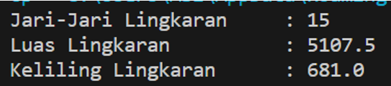

# Pertemuan 2

NIM : 2241720139

Nama : Najwa Azzahra

Kelas : TI-2C

## Percobaan 1

1. Gambarkan desain class diagram dari studi kasus 1!

   

2. Sebutkan Class apa saja yang bisa dibuat dari studi kasus 1!
   - Class Karyawan dan Class Main
3. Sebutkan atribut beserta tipe datanya yang dapat diidentifikasi dari masing-masing
   class dari studi kasus 1!

   

4. Sebutkan method-method yang sudah anda buat dari masing-masing class pada studi
   kasus 1!

   

## Percobaan 2

**Class Mahasiswa**


**Class MahasiswaMain**


**Output**


7. Jelaskan pada bagian mana proses pendeklarasian atribut pada program diatas!

   - Proses pendeklarasian terdapat pada class main

   ```java
   mahasiswa mhs = new Mahasiswa();
   ```

8. Jelaskan pada bagian mana proses pendeklarasian method pada program diatas!

   - Proses pendeklarasian method terdapat pada class main

   ```java
   mhs.tampilIdentitas();
   ```

9. Berapa banyak objek yang di instansiasi pada program diatas!

   - Terdapat 1 objek, yaitu objek class Mahasiswa

10. Apakah yang sebenarnya dilakukan pada sintaks program
    mhs1.nim=101
    - Mengubah nilai atribut "nim" dari objek mhs1 menjadi 101. Sintaks ini dapat digunakan untuk mengubah data yang terkait dengan objek tersebut.
11. Apakah yang sebenarnya dilakukan pada sintaks program
    mhs1.tampilBiodata();
    - Ketika mhs1.tampilBiodata() dipanggil, program akan menjalankan kode yang ada di dalam metode "tampilBiodata()" yang terkait dengan objek mhs1
12. Instansiasi 2 objek lagi pada program diatas!

    - Input

      

    - Output

      

## Percobaan 3

**Class Barang1**


**Class TestBarang**


**Output**


7. Apakah fungsi argumen dalam suatu method?
   - Argumen digunakan untuk memberi nilai atau data yang nantinya akan dieksekusi pada method tersebut
8. Ambil kesimpulan tentang kegunaan dari kata kunci return , dan kapan suatu method
   harus memiliki return!
   - Return digunakan untuk mengembalikan argument pada suatu nilai dan digunakan untuk pemanggilan suatu method.

## Tugas 1

Suatu toko persewaan video game salah satu yang diolah adalah peminjaman, dimana data yang dicatat ketika ada orang yang melakukan peminjaman adalah id, nama member, nama game, dan harga yang harus dibayar. Setiap peminjaman bisa menampilkan data hasil peminjaman dan harga yang harus dibayar. Buatlah class diagram pada studi kasus diatas!

Penjelasan:

- Harga yang harus dibayar diperoleh dari lama sewa x harga.
- Diasumsikan 1x transaksi peminjaman game yang dipinjam hanya 1 game saja.

  - Diagram Class

    

## Tugas 2

Buatlah program dari class diagram yang sudah anda buat di no 1!
**Class Persewaan**

   

**Class TestPersewaan**


**Output**

 

## Tugas 3

Buatlah program sesuai dengan class diagram berikut ini:


**Class Lingkaran dan Main**


**Output**



## Tugas 4

Buatlah program sesuai dengan class diagram berikut ini:


Deskripsi/Penjelasan

- Nilai atribut hargaDasar dalam Rupiah dan atribut diskon dalam %
- Method hitungHargaJual() digunakan untuk menghitung harga jual dengan perhitungan berikut ini:
  harga jual = harga dasar – (diskon x harga dasar)
- Method tampilData() digunakan untuk menampilkan nilai dari kode, namaBarang, hargaDasar, diskon dan harga jual.

**Class Lingkaran dan Main**


**Output**


