# Pertemuan 3

NIM : 2241720139

Nama : Najwa Azzahra

Kelas : TI-2C/20

## Percobaan 2

**Class Motor**

```java
package MotorEncapsulation;

public class Motor {
    public int kecepatan = 0;
    public boolean kontakOn = false;

    public void printStatus(){
        if (kontakOn == true) {
            System.out.println("Kontak On");
        } else {
            System.out.println("Kontak Off");
        }
        System.out.println("Kecepatan "+kecepatan+"\n");
    }
}
```

**MotorDemo**

```java
package MotorEncapsulation;

public class MotorDemo {
    public static void main(String[] args) {
        Motor motor = new Motor();
        motor.kecepatan=50;
        motor.printStatus();
        motor.printStatus();

    }
}
```

**Output**

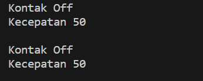

## Percobaan 2

**Class Motor**

```java
package MotorEncapsulation;

public class Motor {
    private int kecepatan = 0;
    private boolean kontakOn = false;

    public void nyalakanMesin(){
        kontakOn = true;
    }
    public void matikanMesin(){
        kontakOn = false;
        kecepatan =0;
    }
    public void tambahKecepatan(){
        if (kontakOn==true) {
            kecepatan +=5;
        }else{
            System.out.println("Kecepatan tidak bisa bertambah karena mesin Off! \n");
        }
    }
    public void kurangiKecepatan(){
        if (kontakOn==true) {
            kecepatan -=5;
        }else{
            System.out.println("Kecepatan tidak bisa berkurang karena mesin Off! \n");
        }
    }

    public void printStatus(){
        if (kontakOn == true) {
            System.out.println("Kontak On");
        } else {
            System.out.println("Kontak Off");
        }
        System.out.println("Kecepatan "+kecepatan+"\n");
    }

}
```

**MotorDemo**

```java
package MotorEncapsulation;

public class MotorDemo {
    public static void main(String[] args) {
        Motor motor = new Motor();
        motor.printStatus();
        motor.tambahKecepatan();

        motor.nyalakanMesin();
        motor.printStatus();

        motor.tambahKecepatan();
        motor.printStatus();

        motor.tambahKecepatan();
        motor.printStatus();

        motor.tambahKecepatan();
        motor.printStatus();

        motor.matikanMesin();
        motor.printStatus();
    }
}
```

**Output**

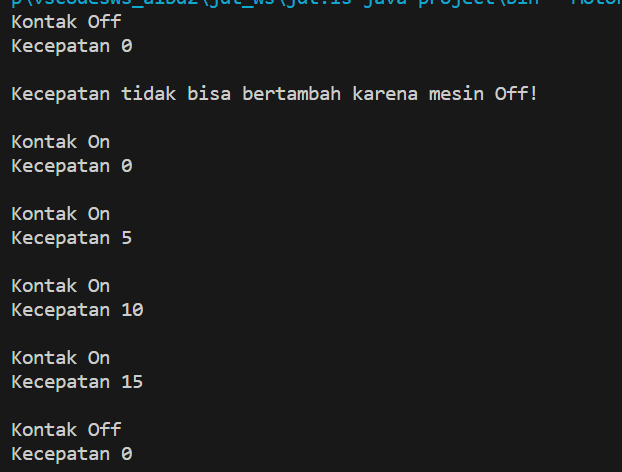

1.  Pada class TestMobil, saat kita menambah kecepatan untuk pertama kalinya, mengapa
    muncul peringatan “Kecepatan tidak bisa bertambah karena Mesin Off!”?

    - Karena pada class Motor, atribut kontakOn dinyatakan false. Setelah itu, method tambahKecepatan() dipanggil sehingga mesin motor dinyatakan nyala.

2.  Mengapat atribut kecepatan dan kontakOn diset private?

    - Agar atribut hanya dapat diakses di kelas yang sama, atribut kecepatan tidak bisa diakses oleh pengguna
      dan diganti nilainya secara sembarangan. Karena apabila atribut motor diset public pengoperasiannya tidak terkontrol dengan baik.

3.  Ubah class Motor sehingga kecepatan maksimalnya adalah 100!

    **Class Motor**

    ```java
    package MotorEncapsulation;

     public class Motor {
     private int kecepatan = 0;
     private boolean kontakOn = false;
     private int kecepatanMax = 100;

     public void nyalakanMesin(){
         kontakOn = true;
     }
     public void matikanMesin(){
         kontakOn = false;
         kecepatan =0;
     }
     public void tambahKecepatan(){
         if (kontakOn==true) {
             if (kecepatan+5 <= 100) {
                 kecepatan +=5;
             } else {
                 System.out.println("Kecepatan maksimum! Tidak dapat bertambah lagi!");
             }
         }else{
             System.out.println("Kecepatan tidak bisa bertambah karena mesin Off! \n");
         }
     }
     public void kurangiKecepatan(){
         if (kontakOn==true) {
             kecepatan -=5;
         }else{
             System.out.println("Kecepatan tidak bisa berkurang karena mesin Off! \n");
         }
     }

     public void printStatus(){
         if (kontakOn == true) {
             System.out.println("Kontak On");
         } else {
             System.out.println("Kontak Off");
         }
         System.out.println("Kecepatan "+kecepatan+"\n");
     }
     }
    ```

    **MotorDemo**

    ```java
    package MotorEncapsulation;

      public class MotorDemo {
      public static void main(String[] args) {
         Motor motor = new Motor();
         motor.printStatus();
         motor.tambahKecepatan();

         motor.nyalakanMesin();
         motor.printStatus();

         motor.tambahKecepatan();
         motor.printStatus();

         motor.tambahKecepatan();
         motor.printStatus();

         motor.tambahKecepatan();
         motor.printStatus();

         motor.tambahKecepatan();
         motor.printStatus();

         motor.tambahKecepatan();
         motor.printStatus();

         motor.tambahKecepatan();
         motor.printStatus();

         motor.tambahKecepatan();
         motor.printStatus();

         motor.tambahKecepatan();
         motor.printStatus();

         motor.tambahKecepatan();
         motor.printStatus();

         motor.tambahKecepatan();
         motor.printStatus();

         motor.tambahKecepatan();
         motor.printStatus();

         motor.tambahKecepatan();
         motor.printStatus();

         motor.tambahKecepatan();
         motor.printStatus();

         motor.tambahKecepatan();
         motor.printStatus();

         motor.tambahKecepatan();
         motor.printStatus();

         motor.tambahKecepatan();
         motor.printStatus();

         motor.tambahKecepatan();
         motor.printStatus();

         motor.tambahKecepatan();
         motor.printStatus();

         motor.tambahKecepatan();
         motor.printStatus();

         motor.tambahKecepatan();
         motor.printStatus();

         motor.tambahKecepatan();
         motor.printStatus();

         motor.tambahKecepatan();
         motor.printStatus();

         motor.tambahKecepatan();
         motor.printStatus();

         motor.tambahKecepatan();
         motor.printStatus();

         motor.matikanMesin();
         motor.printStatus();
     }
     }
    ```

    **Output**

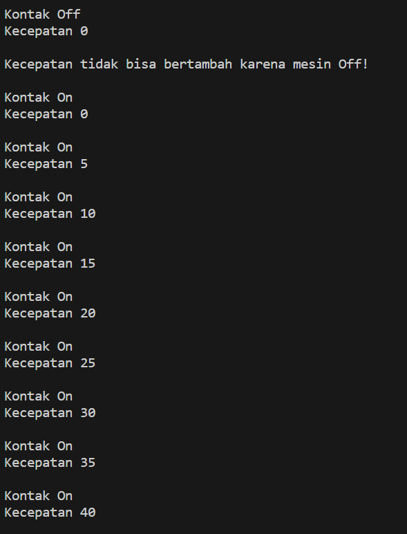
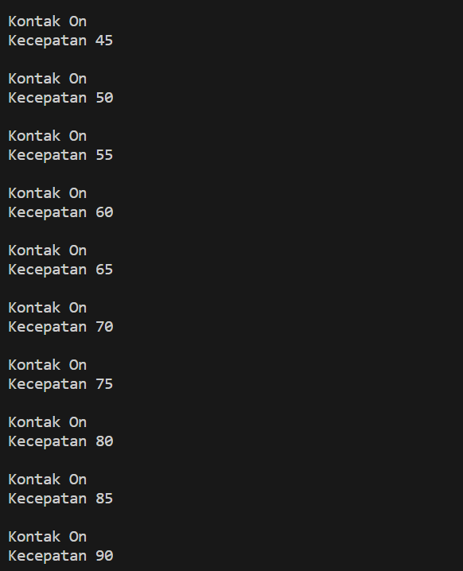
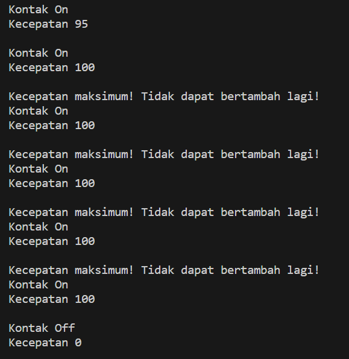

## Percobaan 3

**Class Anggota**

```java
package KoperasiGetterSetter;
public class Anggota {
 private String nama;
 private String alamat;
 private float simpanan;

 Anggota(String nama, String alamat) {
     this.nama = nama;
     this.alamat = alamat;
     this.simpanan = 0;
 }

 public void setNama (String nama) {
     this.nama = nama;
 }

 public void setAlamat (String alamat) {
     this.alamat = alamat;
 }

 public String getNama(){
     return nama;
 }

 public String getAlamat(){
     return alamat;
 }

 public float getSimpanan(){
     return simpanan;
 }

 public void setor (float uang) {
     simpanan += uang;
 }

 public void pinjam (float uang) {
     simpanan -= uang;
 }
}
```

**Koperasi Demo**

```java
package KoperasiGetterSetter;

public class KoperasiDemo {
 public static void main(String[] args) {
     Anggota anggota1 = new Anggota("Iwan", "Jalan Mawar");
     System.out.println("Simpanan "+anggota1.getNama()+" : Rp "+anggota1.getSimpanan());

     anggota1.setNama("Iwan Setiawan");
     anggota1.setAlamat("Jalan Sukarno Hatta no 10");
     anggota1.setor(100000);
     System.out.println("Simpanan "+anggota1.getNama()+" : Rp "+anggota1.getSimpanan());

     anggota1.pinjam(5000);
     System.out.println("Simpanan "+anggota1.getNama()+" : Rp "+anggota1.getSimpanan());
 }
}
```

**Output**

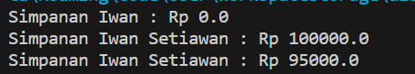

### Pertanyaan

1. Apa yang dimaksud getter dan setter?

- getter adalah method dengan nilai kembalian yang digunakan untuk menampilkan nilai dari suatu atribut
- setter adalah method void yang digunakan untuk memberikan nilai atribut

2. Apa kegunaan dari method getSimpanan()?

- method getSimpanan() digunakan untuk menampilkan nilai atribut simpanan yang berada pada method lain dan method itu sendiri

3. Method apa yang digunakan untuk menambah saldo?

- method setor dengan parameter uang

```java
setor (float uang)
```

4. Apa yand dimaksud konstruktor?

- Konstruktor adalah method khusus yang akan dieksekusi pada saat pembuatan objek (instance).
  Biasanya method ini digunakan untuk inisialisasi data pada objek.

5. Sebutkan aturan dalam membuat konstruktor?

- Nama konstruktor harus sama dengan nama class
- Konstruktor tidak memiliki tipe data return
- Konstruktor tidak boleh menggunakan modifier abstract, static, final, dan syncronized. Tetapi pada java konstruktor dapat memiliki modifier private, protected, public or default.
  2.3 Akses

6. Apakah boleh konstruktor bertipe private?

- Boleh, apabila konstruktor tersebut hanya dapat diakses dari class yang sama dan tidak dapat diakses di class lain

7. Kapan menggunakan parameter dengan passsing parameter?

- Ketika perlu mengirimkan nilai pada sebuah method

8. Apa perbedaan atribut class dan instansiasi atribut?

- Atribut class dapat digunakan di semua objek class, sementara instansiasi atribut adalah atribut yang memiliki nilai yang berbeda di setiap objek. Atribut class bersifat statis dan instansiasi atribut bersifat dinamis

9. Apa perbedaan class method dan instansiasi method?

- Class method adalah method terkait dengan class itu sendiri, sedangkan instansiasi method adalah method yang terkait dengan objek yang dibuat dari class tersebut. Class method bersifat statis, sedangkan instansiasi method bersifat dinamis

## Tugas 1

**Class Anggota**

```java
package Tugas1Encap;
public class EncapDemo {
 private String name;
 private int age;

 public String getName(){
     return name;
 }

 public void setName (String newName) {
     name = newName;
 }

 public int getAge(){
     return age;
 }

 public void setAge(int newAge){
     if (newAge>30) {
         age = 30;
     } else {
         age = newAge;
     }
 }

}
```

**Koperasi Demo**

```java
package Tugas1Encap;
public class EncapTest {
 public static void main(String[] args) {
     EncapDemo encap = new EncapDemo();
     encap.setName("James");
     encap.setAge(35);

     System.out.println("Nama : " + encap.getName());
     System.out.println("Age  : "+encap.getAge());
 }
}
```

**Output**

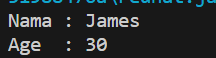

## Percobaan 2

Pada program diatas, pada class EncapTest kita mengeset age dengan nilai 35, namun pada saat ditampilkan ke layar nilainya 30, jelaskan mengapa.

- Karena pada method setAge(int newAge) dituliskan kondisi apabila nilai newAge lebih besar dari 30, maka akan dituliskan 30 (tidak sesuai inputan)

## Percobaan 3

Ubah program diatas agar atribut age dapat diberi nilai maksimal 30 dan minimal 18

**Class EncapDemo**

```java
public void setAge(int newAge) {
        if (newAge < 18) {
            age = 18;
        } else if (newAge > 30) {
            age = 30;
        } else {
            age = newAge;
        }
    }
```

**Class EncapTest**

```java
        encap.setName("James");
        encap.setAge(15);

        System.out.println("Nama : " + encap.getName());
        System.out.println("Age  : "+encap.getAge());
```

**Output**

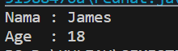

## Percobaan 4

Pada sebuah sistem informasi koperasi simpan pinjam, terdapat class Anggota yang memiliki atribut antara lain nomor KTP, nama, limit peminjaman, dan jumlah pinjaman. Anggota dapat meminjam uang dengan batas limit peminjaman yang ditentukan. Anggota juga dapat
mengangsur pinjaman. Ketika Anggota tersebut mengangsur pinjaman, maka jumlah pinjaman akan berkurang sesuai dengan nominal yang diangsur. Buatlah class Anggota tersebut, berikan atribut, method dan konstruktor sesuai dengan kebutuhan. Uji dengan
TestKoperasi berikut ini untuk memeriksa apakah class Anggota yang anda buat telah sesuai dengan yang diharapkan.

**Class Koperasi**

```java
package Tugas4Koperasi;
public class Koperasi {
    private String nama;
    private String nik;
    private int limit;
    private int pinjam;

    Koperasi(String nik, String nama, int limit) {
        this.nama = nama;
        this.nik = nik;
        this.limit = limit;
    }

    public void setNama (String nama) {
        this.nama = nama;
    }

    public void setNik (String nik) {
        this.nik = nik;
    }

    public String getNama(){
        return nama;
    }

    public String getNik(){
        return nik;
    }

    public int getJumlahPinjaman(){
        return pinjam;
    }

     public int getLimitPinjaman(){
        return limit;
    }

    public void pinjam (int uang) {
        if (uang>=limit) {
            System.out.println("Maaf, jumlah pinjaman melebihi limit!");
        } else {
            pinjam += uang;
        }
    }

    public void angsur (int uang) {
        pinjam -= uang;
    }
}
```

**Class TestKoperasi**

```java
package Tugas4Koperasi;
public class TestKoperasi {
    public static void main(String[] args) {
    Koperasi donny = new Koperasi("111333444", "Donny", 5000000);

    System.out.println("Nama Anggota: " + donny.getNama());
    System.out.println("Limit Pinjaman: " + donny.getLimitPinjaman());
    System.out.println("\nMeminjam uang 10.000.000...");

    donny.pinjam(10000000);
    System.out.println("Jumlah pinjaman saat ini: " + donny.getJumlahPinjaman());
    System.out.println("\nMeminjam uang 4.000.000...");

    donny.pinjam(4000000);
    System.out.println("Jumlah pinjaman saat ini: " + donny.getJumlahPinjaman());
    System.out.println("\nMembayar angsuran 1.000.000");

    donny.angsur(1000000);
    System.out.println("Jumlah pinjaman saat ini: " + donny.getJumlahPinjaman());
    System.out.println("\nMembayar angsuran 3.000.000");

    donny.angsur(3000000);
    System.out.println("Jumlah pinjaman saat ini: " + donny.getJumlahPinjaman());
}
}
```

**Output**

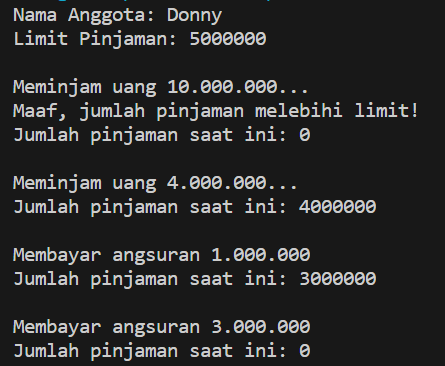

## Percobaan 5

Modifikasi soal no. 4 agar nominal yang dapat diangsur minimal adalah 10% dari jumlah pinjaman saat ini. Jika mengangsur kurang dari itu, maka muncul peringatan “Maaf, angsuran harus 10% dari jumlah pinjaman”.

**Class Koperasi**

```java
 public void angsur (int uang) {
        if (uang < (0.1 * pinjam)) {
            System.out.println("Maaf, angsuran harus 10% dari jumlah pinjaman");
        } else{
            pinjam -= uang;
        }
    }
```

**Class TestKoperasi**

```java
    donny.pinjam(4000000);
    System.out.println("Jumlah pinjaman saat ini: " + donny.getJumlahPinjaman());
    System.out.println("\nMembayar angsuran 100.000");

    donny.angsur(100000);
    System.out.println("Jumlah pinjaman saat ini: " + donny.getJumlahPinjaman());
    System.out.println("\nMembayar angsuran 2.750.000");

    donny.angsur(2750000);
    System.out.println("Jumlah pinjaman saat ini: " + donny.getJumlahPinjaman());
```

**Output**

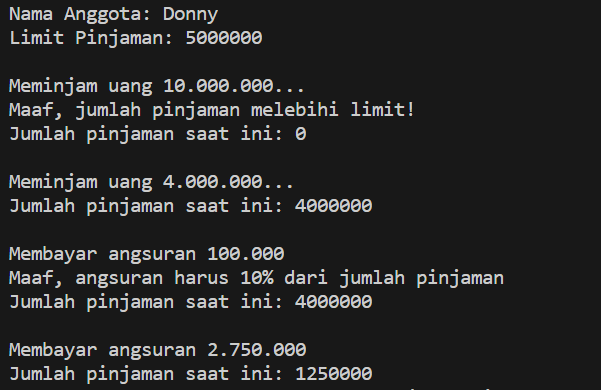

## Percobaan 6

Modifikasi class TestKoperasi, agar jumlah pinjaman dan angsuran dapat menerima input dari console.

**Class Koperasi**

```java
package Tugas4Koperasi;
public class Koperasi {
    private String nama;
    private String nik;
    private int limit;
    private int pinjam;

    Koperasi(String nik, String nama, int limit) {
        this.nama = nama;
        this.nik = nik;
        this.limit = limit;
    }

    public void setNama (String nama) {
        this.nama = nama;
    }

    public void setNik (String nik) {
        this.nik = nik;
    }

    public String getNama(){
        return nama;
    }

    public String getNik(){
        return nik;
    }

    public int getJumlahPinjaman(){
        return pinjam;
    }

     public int getLimitPinjaman(){
        return limit;
    }

    public void pinjam (int uang) {
        if (uang>=limit) {
            System.out.println("Maaf, jumlah pinjaman melebihi limit!");
        } else {
            pinjam += uang;
        }
    }

    public void angsur (int uang) {
        if (uang < (0.1 * pinjam)) {
            System.out.println("Maaf, angsuran harus 10% dari jumlah pinjaman");
        } else{
            pinjam -= uang;
        }
    }
}
```

**Class TestKoperasi**

```java
    package Tugas4Koperasi;

import java.util.Scanner;

public class TestKoperasi {
    public static void main(String[] args) {
    Scanner sc1 = new Scanner(System.in);
    Scanner sc2 = new Scanner(System.in);

    Koperasi donny = new Koperasi("111333444", "Donny", 11000000);
    System.out.println("Nama Anggota\t\t\t: " + donny.getNama());
    System.out.println("Limit Pinjaman\t\t\t: Rp" + donny.getLimitPinjaman());

    //pinjam ditolak
    System.out.print("\nPengajuan Pinjaman\t\t: Rp");
    int pinjam = sc2.nextInt();
    donny.pinjam(pinjam);
    System.out.print("Jumlah pinjaman saat ini\t: Rp" + donny.getJumlahPinjaman());

    //pinjam acc
    System.out.print("\n\nPengajuan Pinjaman\t\t: Rp");
    pinjam = sc2.nextInt();
    donny.pinjam(pinjam);
    System.out.println("Jumlah pinjaman saat ini\t: Rp" + donny.getJumlahPinjaman());

    //bayar angsuran 1 ditolak
    System.out.println();
    System.out.print("Membayar Angsuran\t\t: Rp");
    int angsur = sc2.nextInt();
    donny.angsur(angsur);
    System.out.print("Jumlah pinjaman saat ini\t: Rp" + donny.getJumlahPinjaman());

    //bayar angsuran 2 acc
    System.out.println();
    System.out.print("\nMembayar Angsuran\t\t: Rp");
    angsur = sc2.nextInt();
    donny.angsur(angsur);
    System.out.print("Jumlah pinjaman saat ini\t: Rp" + donny.getJumlahPinjaman());
}
}
```

**Output**

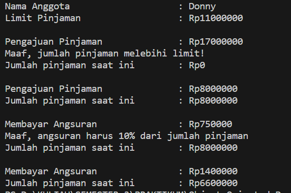
