# Jobsheet 4

NIM : 2241720139

Nama : Najwa Azzahra

Kelas : TI-2C/20

## Percobaan 1


**Class Processor**

```java
package najwa.relasiclass.percobaan1;
public class Processor {
    private String merk;
    private double cache;
    
    public Processor(){
    }

    public Processor (String merk, double cache){
        this.merk = merk;
        this.cache = cache;
    }

    public void setMerk (String merk) {
        this.merk = merk;
    }

    public void setCache (double cache) {
        this.cache = cache;
    }

    public String getMerk () {
        return merk;
    }

    public double getCache() {
        return cache;
    }

    public void info () {
        System.out.printf("Merk Processor = %s\n", merk);
        System.out.printf("Cache Memory = %.2f\n", cache);
    }
}
```

**Class Laptop**

```java
import najwa.relasiclass.percobaan1.Processor;
public class Laptop {

    private String merk;
    private Processor proc;

    public Laptop (String merk, Processor proc){
        this.merk = merk;
        this.proc = proc;
    }

      public Laptop(){
    }

    public void setMerk (String merk) {
        this.merk = merk;
    }

    public String getMerk () {
        return merk;
    }


     public void setProc (Processor proc) {
        this.proc = proc;
    }

    public String getProc () {
        return proc;
    }

    public void info() {
        System.out.println("Merk Laptop = " + merk);
        proc.info();
        }
}
```

**Class Main**

```java
import najwa.relasiclass.percobaan1.Processor;

public class MainPercobaan1 {

    public static void main(String[] args) {
        Processor p = new Processor("Intel i5", 3);
        Laptop l = new Laptop("Thinkpad", p);


        l.info();

        Processor p1 = new Processor();
        p1.setMerk("Intel i5");
        p1.setCache(4);
        Laptop L1 = new Laptop();
        L1.setMerk("Thinkpad");
        L1.setProc(p1);
        L1.info();
    }
}
```

**Output**

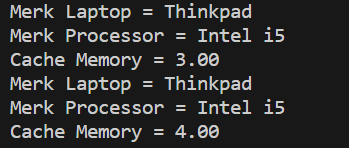

### Pertanyaan

1. Di dalam class Processor dan class Laptop , terdapat method setter dan getter untuk masing‑masing atributnya. Apakah gunanya method setter dan getter tersebut?

**jawab**

- method setter digunakan untuk mengatur nilai dari suatu atribut
- method getter digunakan untuk menampilkan nilai dari suatu atribut

2. Di dalam class Processor dan class Laptop, masing‑masing terdapat konstruktor default dan konstruktor berparameter. Bagaimanakah beda penggunaan dari kedua jenis konstruktor tersebut?

**jawab**

- Dalam penggunaan konstruktor default, pada proses inisialisasi tanpa menggunakan parameter. Nilai dari atributnya akan diatur melalui method setter
- Sedangkan untuk penggunaan konstruktor berparameter, pada proses inisialisasi perlu mengisikan nilai atribut pada parameter

3. Perhatikan class Laptop, di antara 2 atribut yang dimiliki (merk dan proc), atribut manakah yang bertipe object?

**jawab**

atribut proc yang bertope objek class Processor

4. Perhatikan class Laptop, pada baris manakah yang menunjukan bahwa class Laptop memiliki relasi dengan class Processor?

**jawab**

pada pendefinisian tipe data dan atribut
```java 
private Processor proc;
```

5. Perhatikan pada class Laptop , Apakah guna dari sintaks proc.info()?

**jawab**

untuk menampilkan merk processor dan cache memory yang didapatkan dari class processor

6. Laptop l = new Laptop("Thinkpad", p);Apakah p tersebut?Dan apakah yang terjadi jika baris kode tersebut diubah menjadi: Laptop l = new Laptop("Thinkpad", new Processor("Intel i5", 3));
**jawab**
- p tersebut adalah penulisan atribut yang isinya sama dengan objek p pada inisialisasi processor
Bagaimanakah hasil program saat dijalankan, apakah ada perubahan?
- Ketika baris kode diubah menjadi Laptop l = new Laptop("Thinkpad", new Processor("Intel i5", 3)); maka hasilnya akan sama, dikarenakan atribut proc didapatkan dari class Processor

**output**

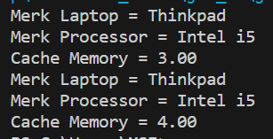


## Percobaan 2


**Class Sopir**

```java
public class Sopir {
    private String nama;
    private int biaya;

    public Sopir(){
    }

    public void setNama (String nama) {
        this.nama = nama;
    }

    public String getNama () {
        return nama;
    }

    public void setBiaya (int biaya) {
        this.biaya = biaya;
    }

    public int getBiaya () {
        return biaya;
    }

    public int hitungBiayaSopir (int hari) {
        return biaya * hari;
    }
    
}
```

**Class Mobil**

```java
public class Mobil {
        private String merk;
        private int biaya;
    
        public Mobil(){
        }
    
        public void setMerk (String merk) {
            this.merk = merk;
        }
    
        public String getMerk () {
            return merk;
        }
    
        public void setBiaya (int biaya) {
            this.biaya = biaya;
        }
    
        public int getBiaya () {
            return biaya;
        }
    
        public int hitungBiayaMobil (int hari) {
            return biaya * hari;
        }
        
}
```

**Class Pelanggan**

```java
public class Pelanggan {

    private String nama;
    private Mobil mobil;
    private Sopir sopir;
    private int hari;
    
    public void setNama (String nama) {
        this.nama = nama;
    }

    public String getNama () {
        return nama;
    }

    public void setMobil (Mobil mobil) {
        this.mobil = mobil;
    }

    public Mobil getMobil () {
        return mobil;
    }

    public void setSopir (Sopir sopir) {
        this.sopir = sopir;
    }

    public Sopir getSopir () {
        return sopir;
    }

    public void setHari (int hari) {
        this.hari = hari;
    }

    public int getHari () {
        return hari;
    }

    public int hitungBiayaTotal() {
        return mobil.hitungBiayaMobil(hari) + 
        sopir.hitungBiayaSopir(hari);
    }
}
```

**Class Main**


```java
public class MainPercobaan2 {

    public static void main(String[] args) {
        Mobil m = new Mobil();
        m.setMerk("Avanza");
        m.setBiaya(350000);
        Sopir s = new Sopir();
        s.setNama("John Doe");
        s.setBiaya(200000);
        Pelanggan p = new Pelanggan();
        p.setNama("Jane Doe");
        p.setMobil(m);
        p.setSopir(s);
        p.setHari(2);
        System.out.println("Biaya Total = " + 
        p.hitungBiayaTotal());  
    }
}
```

**Output**

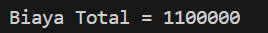

### Pertanyaan

1. Perhatikan class Pelanggan. Pada baris program manakah yang menunjukan bahwa class
Pelanggan memiliki relasi dengan class Mobil dan class Sopir ?

**jawab**
Pada penulisan atribut yang bertipe objek
```java 
    private Mobil mobil;
    private Sopir sopir;
```

2. Perhatikan method hitungBiayaSopir pada class Sopir, serta method hitungBiayaMobil pada class Mobil. Mengapa menurut Anda method tersebut harus memiliki argument hari ?

**jawab**

karena perhitungan biaya total bergantung pada perhitungan biaya mobil dan sopir, yang mana kedua method tersebut bergantung pada jumlah hari pemesanan. 

3. Perhatikan kode dari class Pelanggan. Untuk apakah perintah mobil.hitungBiayaMobil(hari) dan sopir.hitungBiayaSopir(hari) ?

**jawab**

untuk menghitung biaya sopir dan biaya mobil berdasarkan harga per hari dan jumlah hari pemesanan dan nantinya kedua method tersebut akan ditotalkan di method hitungBiayaTotal

4. Perhatikan class MainPercobaan2. Untuk apakah sintaks p.setMobil(m) dan p.setSopir(s) ?

**jawab**

untuk menghubungkan atribut objek m pada class mobil dan atribut objek s pada class sopir ke atribut objek p pada class pelanggan

5. Perhatikan class MainPercobaan2. Untuk apakah proses p.hitungBiayaTotal() tersebut ?

**jawab**

untuk menghitung biaya yang harus dibayar pelanggan dalam memesan mobil dan sopir

6. Perhatikan class MainPercobaan2, coba tambahkan pada baris terakhir dari method main dan amati perubahan saat di‑run!
System.out.println(p.getMobil().getMerk());
Jadi untuk apakah sintaks p.getMobil().getMerk() yang ada di dalam method 
main tersebut?

**output**

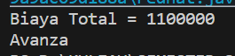


### Pertanyaan

**jawab**

- kode program tersebut menampilkan jenis merk mobil yang dipesan pelanggan, yang mana atribut merk diambil dari class pelanggan yang dihubungkan pada class mobil


## Percobaan 3


**Class KeretaApi**

```java
public class KeretaApi {

    private String nama;
    private String kelas;
    private Pegawai masinis;
    private Pegawai asisten;

    public KeretaApi (String nama, String kelas, Pegawai masinis){
        this.nama=nama;
        this.kelas=kelas;
        this.masinis=masinis;
    }

    public KeretaApi (String nama, String kelas, Pegawai masinis, Pegawai asisten){
        this.nama=nama;
        this.kelas=kelas;
        this.masinis=masinis;
        this.asisten=asisten;
    }

    public void setNama (String nama) {
        this.nama = nama;
    }

    public String getNama () {
        return nama;
    }

    public void setKelas (String kelas) {
        this.kelas = kelas;
    }

    public String getkelas () {
        return kelas;
    }

    public void setMasinis (Pegawai masinis) {
        this.masinis = masinis;
    }

    public String getMasinis () {
        return masinis;
    }

    public void setAsisten (Pegawai asisten) {
        this.asisten = asisten;
    }

    public String getAsisten () {
        return asisten;
    }
    
    public String info() {
        String info = "";
        info += "Nama: " + this.nama + "\n";
        info += "Kelas: " + this.kelas + "\n";
        info += "Masinis: " + this.masinis.info() + "\n";
        info += "Asisten: " + this.asisten.info() + "\n";
        return info;
        }
}
```


**Class Pegawai**

```java
public class Pegawai {

    private String nip;
    private String nama;

    public Pegawai(String nip, String nama) {
        this.nip=nip;
        this.nama=nama;
    }

    public void setNip (String nip) {
        this.nip = nip;
    }

    public String getNip () {
        return nip;
    }

    public void setNama (String nama) {
        this.nama = nama;
    }

    public String getNama () {
        return nama;
    }

    public String info() { 
        String info = "";
        info += "Nip: " + this.nip + "\n";
        info += "Nama: " + this.nama + "\n";
        return info;
    }
}
```

**Class Main**


```java
public class MainPercobaan3 {

    public static void main(String[] args) {
        Pegawai masinis = new Pegawai("1234", "Spongebob Squarepants");
        Pegawai asisten = new Pegawai("4567", "Patrick Star");
        KeretaApi keretaApi = new KeretaApi("Gaya Baru", "Bisnis", masinis, asisten);
        System.out.println(keretaApi.info());
    }
}
```

**Output**

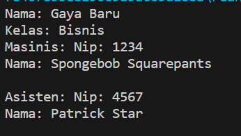

### Pertanyaan

1. Di dalam method info() pada class KeretaApi, baris this.masinis.info() dan this.asisten.info() digunakan untuk apa ?

**jawab**
baris tersebut digunakan untuk mengembalikan nilai atribut masinis dan asisten yang dituliskan pada objek Pegawai

2. Buatlah main program baru dengan nama class MainPertanyaan pada package yang sama. Tambahkan kode berikut pada method main() !
```java 
Pegawai masinis = new Pegawai("1234", "Spongebob 
Squarepants");
KeretaApi keretaApi = new KeretaApi("Gaya Baru", "Bisnis", 
masinis);
System.out.println(keretaApi.info());
```

**jawab**
```java
public class MainPertanyaan {
    public static void main(String[] args) {
        Pegawai masinis = new Pegawai("1234", "Spongebob Squarepants");
        KeretaApi keretaApi = new KeretaApi("Gaya Baru", "Bisnis", masinis);
        System.out.println(keretaApi.infoEdit());
    }
}
```


3. Apa hasil output dari main program tersebut ? Mengapa hal tersebut dapat terjadi ?

**jawab**

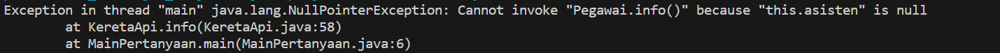

Program tidak dapat dijalankan karena pada class keretaApi dengan method info() terdapat pemanggilan untuk menampilkan asisten pegawai, sedangan pada class main, atribut asisten tidak dituliskan

4. Perbaiki class KeretaApi sehingga program dapat berjalan !

**jawab**

**Penambahan method pada class KeretaApi** 

```java
public String infoEdit() {
        String info = "";
        info += "Nama: " + this.nama + "\n";
        info += "Kelas: " + this.kelas + "\n";
        info += "Masinis: " + this.masinis.info() + "\n";
        return info;
        }
```

**class Main**
```java
public class MainPertanyaan {
    public static void main(String[] args) {
        Pegawai masinis = new Pegawai("1234", "Spongebob Squarepants");
        KeretaApi keretaApi = new KeretaApi("Gaya Baru", "Bisnis", masinis);
        System.out.println(keretaApi.infoEdit());
    }
}
```

**Output**

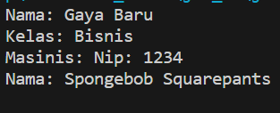

## Percobaan 4


**Class Penumpang**

```java
public class Penumpang {

    private String ktp;
    private String nama;

    public Penumpang(String ktp, String nama) {
        this.ktp=ktp;
        this.nama=nama;
    }

    public void setKtp (String ktp) {
        this.ktp = ktp;
    }

    public String getKtp () {
        return ktp;
    }

    public void setNama (String nama) {
        this.nama = nama;
    }

    public String getNama () {
        return nama;
    }

    public String info() {
        String info = "";
        info += "Ktp: " + ktp + "\n";
        info += "Nama: " + nama + "\n";
        return info;
    }
}
```


**Class Kursi**

```java
public class Kursi {

    private String nomor;
    private Penumpang penumpang;

    public Kursi(String nomor) {
        this.nomor=nomor;
    }

    public void setNomor (String nomor) {
        this.nomor = nomor;
    }

    public String getNomor () {
        return penumpang;
    }

    public void setPenumpang (Penumpang penumpang) {
        this.penumpang = penumpang;
    }

    public Penumpang getPenumpang () {
        return penumpang;
    }

    public String info() {
        String info = "";
        info += "Nomor: " + nomor + "\n";
        if (this.penumpang != null) {
        info += "Penumpang: " + penumpang.info() + "\n";
        }
        return info;
        }
}
```

**Class Gerbong**


```java
public class Gerbong {

    private String kode;
    private Kursi[] arrayKursi;

    private void initKursi() {
        for (int i = 0; i < arrayKursi.length; i++) {
        this.arrayKursi[i] = new Kursi(String.valueOf(i + 1));
        }
    }

    public Gerbong(String kode, int jumlah) {
        this.kode = kode;
        this.arrayKursi = new Kursi[jumlah];
        this.initKursi();
    }

    public void setKode (String kode) {
        this.kode = kode;
    }

    public String getKode () {
        return kode;
    }

    public String info() {
        String info = "";
        info += "Kode: " + kode + "\n";
        for (Kursi kursi : arrayKursi) {
        info += kursi.info();
        }
        return info;
    }

    public void setPenumpang(Penumpang penumpang, int nomor) {
        this.arrayKursi[nomor - 1].setPenumpang(penumpang);
    }

    public Kursi[] getArrayKursi() {
        return arrayKursi;
    }
}
```

**Class Main**


```java
public class MainPercobaan4 {
    public static void main(String[] args) {
        Penumpang p = new Penumpang("12345", "Mr. Krab");
        Gerbong gerbong = new Gerbong("A", 10);
        gerbong.setPenumpang(p, 1);
        System.out.println(gerbong.info());
    }
}
```

**Output**

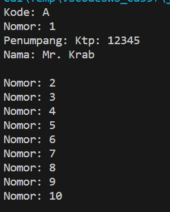

1. Pada main program dalam class MainPercobaan4, berapakah jumlah kursi dalam Gerbong A ?

**jawab**
ada 10


2. Perhatikan potongan kode pada method info() dalam class Kursi. Apa maksud kode tersebut ?

```java 
if (this.penumpang != null) {
info += "Penumpang: " + penumpang.info() + "\n";
}
```

**jawab**
apabila kursi penumpang tidak sama dengan null (kosong), maka akan memanggil method info() dari objek Penumpang
 

3. Mengapa pada method setPenumpang() dalam class Gerbong, nilai nomor dikurangi dengan angka 1 ?

**jawab**

untuk mengakses elemen arrayKursi yang sesuai dengan nomor kursi yang dituliskan, karena array dimulai dari 0, maka nomor-1 digunakan untuk mengubah nomor kursi menjadi indeks array yang sesuai.

4. Instansiasi objek baru budi dengan tipe Penumpang, kemudian masukkan objek baru 
tersebut pada gerbong dengan gerbong.setPenumpang(budi, 1). Apakah yang terjadi ?

**Output**

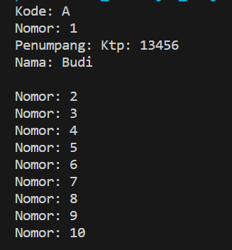

Maka penumpang sebelumnya yang menempati kursi no. 1 akan teralihkan

5. Modifikasi program sehingga tidak diperkenankan untuk menduduki kursi yang sudah ada penumpang lain !

**jawab**
 
Dengan memodifikasi pada class Gerbong method setPenumpang

```java
 public void setPenumpang(Penumpang penumpang, int nomor) {
        Kursi kursi = this.arrayKursi[nomor - 1];
        if (kursi.getPenumpang() == null) {
            kursi.setPenumpang(penumpang);
        } else {
            Penumpang penumpangSebelumnya = kursi.getPenumpang();
            System.out.println("Kursi nomor " + nomor + " sudah terisi oleh " + penumpangSebelumnya.getNama());
        }
    }
```

**Output**

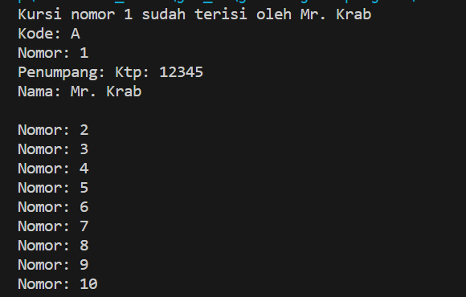


## Tugas

1. Berdasarkan latihan di pertemuan teori, rancang dengan class diagram, kemudian implementasikan 
ke dalam program! Studi kasus harus mewakili relasi class dari percobaan‑percobaan yang telah 
dilakukan pada materi ini, setidaknya melibatkan minimal 4 class (class yang berisi main tidak 
dihitung)

**Jawab**
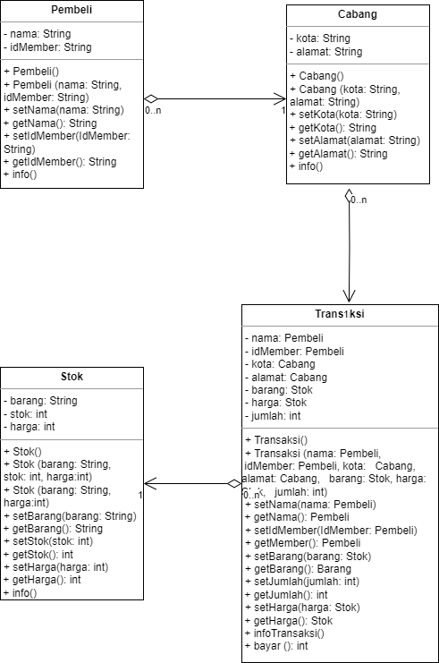

**Class Pembeli**
```java
public class Pembeli {

    private String nama;
    private String idMember;

    public Pembeli (){

    }
    
    public Pembeli(String nama, String idMember) {
        this.nama = nama;
        this.idMember = idMember;
    }

    public void setNama (String nama) {
        this.nama = nama;
    }

    public String getNama () {
        return nama;
    }

    public void setIdMember (String idMember) {
        this.idMember = idMember;
    }

    public String getIdMember () {
        return idMember;
    }

    public String info() {
        String info = "";
        System.out.println("=========Member Purnama Luxury Store=========");
        info += "Nama\t\t: " + nama + "\n";
        info += "IdMember\t: " + idMember + "\n";
        return info;
    }
}
```


**Class Stok**
```java
public class Stok {

    private String barang;
    private int stok;
    private int harga;

    public Stok (){

    }

    public Stok (String barang, int stok, int harga) {
        this.barang = barang;
        this.stok = stok;
        this.harga = harga;
    }

    public Stok (String barang,  int harga) {
        this.barang = barang;
        this.harga = harga;
    }

    public void setBarang (String barang) {
        this.barang = barang;
    }

    public String getBarang () {
        return barang;
    }

    public void setStok (int stok) {
        this.stok = stok;
    }

    public int getStok () {
        return stok;
    }

    public void setHarga (int harga) {
        this.harga = harga;
    }

    public int getHarga () {
        return harga;
    }

    
    public String info (){
        String info = "";
        System.out.println("=========Stok Purnama Luxury Store=========");
        info += "Barang\t: " + barang + "\n";
        info += "Stok\t: " + stok + "\n";
        info += "Harga\t: Rp" + harga + "\n";
        return info;
    }

}
```


**Class Transaksi**
```java
public class Transaksi {

    private Pembeli nama;
    private Pembeli idMember;
    private Stok barang;
    private Stok harga;
    private int jumlah;
    private Cabang kota;
    private Cabang alamat;

    public Transaksi (){
    }

    public Transaksi (Pembeli nama, Pembeli idMember, Stok barang, Stok harga, int jumlah, Cabang kota, Cabang alamat) {
        this.nama=nama;
        this.idMember=idMember;
        this.barang=barang;
        this.harga=harga;
        this.jumlah=jumlah;
        this.kota = kota;
        this.alamat=alamat;
    }

    public void setNama (Pembeli nama) {
        this.nama = nama;
    }

    public Pembeli getNama () {
        return nama;
    }

    public void setIdMember (Pembeli idMember) {
        this.idMember = idMember;
    }

    public Pembeli getIdMember () {
        return idMember;
    }

    public void setBarang (Stok barang) {
        this.barang = barang;
    }

    public Stok getBarang () {
        return barang;
    }

    public void setHarga (Stok harga) {
        this.harga = harga;
    }

    public Stok getHarga () {
        return harga;
    }

    public void setJumlah (int jumlah) {
        this.jumlah = jumlah;
    }

    public int getjumlah () {
        return jumlah;
    }

    public int bayar() {
        int total = harga.getHarga() * jumlah;
        if (total>450000) {
            total= total-(int)(total*0.2);
            System.out.println("Selamat anda mendapatkan diskon 20%");
        } else {
            total = total;
        }
        return total;
    }
    
    public void setKota (Cabang kota) {
        this.kota = kota;
    }

    public Cabang getKota () {
        return kota;
    }

    public void setAlamat (Cabang alamat) {
        this.alamat = alamat;
    }

    public Cabang getAlamat () {
        return alamat;
    }

    public String infoTransaksi() {
        String info = "";
        info += "========Purnama Luxury Store=========\n";
        info += "Cabang\t: " + kota.getKota() + "\n";
        info += "Alamat\t: " + alamat.getAlamat() + "\n";
        info += "Nama\t: " + nama.getNama() + "\n";
        info += "IdMember: " + idMember.getIdMember() + "\n";
        info += "Barang\t: " + barang.getBarang() + "\n";
        info += "Harga\t: Rp" + harga.getHarga() + "\n";
        return info;
    }
}
```


**Class Cabang**
```java
public class Cabang {

    private String kota;
    private String alamat;

    public Cabang (){

    }

    public Cabang (String kota, String alamat) {
        this.kota=kota;
        this.alamat=alamat;
    }

    public void setKota (String kota) {
        this.kota = kota;
    }

    public String getKota () {
        return kota;
    }

    public void setAlamat (String alamat) {
        this.alamat = alamat;
    }

    public String getAlamat () {
        return alamat;
    }

    public String info (){
        String info = "";
        System.out.println("=========Cabang Purnama Luxury Store=========");
        info += "Cabang\t: " + kota + "\n";
        info += "Alamat\t: " + alamat + "\n";
        return info;
    }
}
```


**Class Main**
```java
public class MainTugas {

    public static void main(String[] args) {
        Stok s = new Stok();
        s.setBarang("Luminous Bag");
        s.setHarga(670000);

        Pembeli p = new Pembeli();
        p.setNama("Jeanne Sisca");
        p.setIdMember("24517171");

        Cabang c = new Cabang();
        c.setKota("Surabaya");
        c.setAlamat("Mall Tunjungan Plaza");

        Transaksi t = new Transaksi();
        t.setKota(c);
        t.setAlamat(c);
        t.setNama(p);
        t.setIdMember(p);
        t.setBarang(s);
        t.setHarga(s);
        t.setJumlah(1);

        System.out.println(t.infoTransaksi());
        System.out.println("Biaya Total\t: Rp" + t.bayar());
        
    }
}
```

**Output**

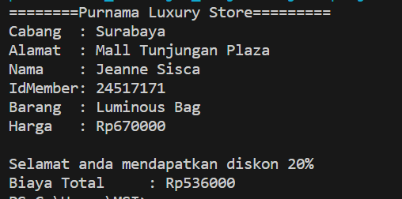
