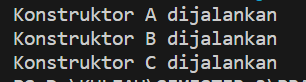
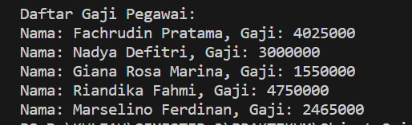

# Jobsheet 6 Inheritance

NIM : 2241720139

Nama : Najwa Azzahra

Kelas : TI-2C/20

## Percobaan 1

**ClassA**

```java
package Praktikum1;
public class ClassB {
    public int z;

    public void getNilaiZ(){
        System.out.println("Nilai z: " + z);
    }

    public void getJumlah(){
        System.out.println("Jumlah :" + (x+y+z));
    }
}
```

**ClassA**

```java
package Praktikum1;
public class ClassA {
    public int x;
    public int y;

    public void getNilai() {
        System.out.println("Nilai x: " + x);
        System.out.println("Nilai y: " + y);
    }

}
```

**Class Percobaan1**

```java
package Percobaan1;

import Praktikum1.ClassB;

public class Percobaan1 {

    public static void main(String[] args) {
        ClassB hitung = new ClassB();
        hitung.x=20;
        hitung.y=30;
        hitung.z=5;
        hitung.getNilai();
        hitung.getNilaiZ();
        hitung.getJumlah();
    }
}
```

**Output**


### Pertanyaan

1. Pada percobaan 1 diatas program yang dijalankan terjadi error, kemudian perbaiki sehingga program tersebut bisa dijalankan dan tidak error!

   **Jawaban**
   Dengan menambahkan kode dibawah ini pada classB setelah deklarasi classB

   ```java
   extends ClassA
   ```

   **Output**

   

2. Jelaskan apa penyebab program pada percobaan 1 ketika dijalankan terdapat error!

   **Jawaban**

   Program tersebut menggunakan konsep inheritance tetapi tidak menuliskan kode program inheritance yang sesuai. Dalam kode program tersebut, ClassB mencoba mengakses variabel x dan y serta metode getNilai() dari ClassA, yang diwarisi dari ClassA. Namun, tidak mendefinisikan hubungan pewarisan antara ClassA dan ClassB. Oleh karena itu, compiler tidak menemukan variabel x dan y atau metode getNilai() dalam ClassB. Untuk mengatasi hal tersebut, perlu menggunakan metode inheritance dengan kata kunci extends.

## Percobaan 2

**ClassA**

```java
package Praktikum2;
public class ClassA {
    public int x;
    public int y;

    public void setX(int x){
        this.x=x;
    }

    public void setY(int y){
        this.y=y;
    }

    public void getNilai() {
        System.out.println("Nilai x: " + x);
        System.out.println("Nilai y: " + y);
    }

}
```

**ClassB**

```java
package Praktikum2;
public class ClassB{
    public int z;

    public void setZ(int z){
        this.z=z;
    }

    public void getNilaiZ(){
        System.out.println("Nilai z: " + z);
    }

    public void getJumlah(){
        System.out.println("Jumlah : " + (x+y+z));
    }

}
```

**Class Percobaan2**

```java
import Praktikum1.ClassB;

public class Percobaan2 {

    public static void main(String[] args) {
        ClassB hitung = new ClassB();
        hitung.setX(20);
        hitung.setY(30);
        hitung.setZ(5);
        hitung.getNilai();
        hitung.getNilaiZ();
        hitung.getJumlah();
    }
}
```

**Output**


### Pertanyaan

1. Pada percobaan 2 diatas program yang dijalankan terjadi error, kemudian perbaiki sehingga program tersebut bisa dijalankan dan tidak error!

   **Jawaban**

   Dengan menambahkan kode dibawah ini pada classB setelah deklarasi classB

   ```java
   extends ClassA
   ```

   **Output**

   

2. Jelaskan apa penyebab program pada percobaan 2 ketika dijalankan terdapat error!

   **Jawaban**

   Program tersebut menggunakan konsep inheritance tetapi tidak menuliskan kode program inheritance yang sesuai. Dalam kode program tersebut, ClassB mencoba mengakses variabel x dan y serta metode getNilai() dari ClassA, yang diwarisi dari ClassA. Namun, tidak mendefinisikan hubungan pewarisan antara ClassA dan ClassB. Oleh karena itu, compiler tidak menemukan variabel x dan y atau metode getNilai() dalam ClassB. Untuk mengatasi hal tersebut, perlu menggunakan metode inheritance dengan kata kunci extends.

## Percobaan 3

**Class Bangun**

```java
public class Bangun {

    protected double phi;
    protected int r;
}
```

**Class Tabung**

```java
public class Tabung extends Bangun{

    protected int t;
    public void setSuperPhi (double phi) {
        super.phi=phi;
    }

    public void setSuperR (int r) {
        super.r=r;
    }

    public void setT (int t){
        this.t=t;
    }

    public void volume() {
        System.out.println("Volume Tabung Adalah: " + (super.phi*super.r*super.r*this.t));
    }
}
```

**Class Percobaan3**

```java
public class Percobaan3 {

    public static void main(String[] args) {
        Tabung tabung = new Tabung();
        tabung.setSuperPhi(3.14);
        tabung.setSuperR(10);
        tabung.setT(3);
        tabung.volume();
    }
}
```

**Output**


### Pertanyaan

1. Jelaskan fungsi “super” pada potongan program berikut di class Tabung!

```java
public void setSuperR (int r) {
        super.r=r;
    }
```

**Jawaban**

    Kode program 'super' digunakan untuk merujuk pada variabel super class (class Bangun) agar tidak menimbulkan ambiguitas ketika mengakses variabel dengan nama yang sama pada sub class

2. Jelaskan fungsi “super” dan “this” pada potongan program berikut di class Tabung!

```java
(super.phi*super.r*super.r*this.t)
```

**Jawaban**

- 'super' digunakan untuk merujuk pada variabel di super class (class Bangun)
- 'this' digunakan untuk merujuk pada variabel di class saat ini (class Tabung)

Dengan menuliskan 'super' dan 'this', variabel dapat membantu membedakan antara variabel lokal dan variabel kelas saat ini

3. Jelaskan mengapa pada class Tabung tidak dideklarasikan atribut “phi” dan “r” tetapi class tersebut dapat mengakses atribut tersebut!

   **Jawaban**

   Karena kode program tersebut memuat konsep inheritance dengan class Bangun menjadi super class dan class Tabung menjadi sub class, sehingga tidak perlu mendeklarasikan variabel yang sudah ada di super class

## Percobaan 4

**ClassA**

```java
package Praktikum4;
public class ClassA {
    ClassA(){
        System.out.println("Konstruktor A dijalankan");
    }
}
```

**ClassB**

```java
package Praktikum4;
public class ClassB extends ClassA {
    ClassB() {
        System.out.println("Konstruktor B dijalankan");
    }

}
```

**ClassC**

```java
package Praktikum4;
public class ClassC extends ClassB {
    ClassC() {
        System.out.println("Konstruktor C dijalankan");
    }
}
```

**Class Percobaan4**

```java
package Praktikum4;
public class Percobaan4 {

    public static void main(String[] args) {
        ClassC test = new ClassC();
    }
}
```

**Output**


### Pertanyaan

1. Pada percobaan 4 sebutkan mana class yang termasuk superclass dan subclass, kemudian jelaskan alasannya!

   **Jawaban**

   - Class A adalah superclass dari ClassB dan ClassC, hal tersebut berarti ClassB dan ClassC adalah subclass dari ClassA
   - Class B adalah superclass dari ClassC, hal tersebut berarti ClassC adalah subclass dari ClassB

2. Ubahlah isi konstruktor default ClassC seperti berikut:

   

   Tambahkan kata super() di baris Pertaman dalam konstruktor defaultnya. Coba jalankan kembali class Percobaan4 dan terlihat tidak ada perbedaan dari hasil outputnya!

   **Jawaban**

   ```java
   package Praktikum4;
   public class ClassC extends ClassB {

   ClassC() {
       super();
       System.out.println("Konstruktor C dijalankan");
   }
   }
   ```

   Dengan memanggil super(); dalam konstruktor ClassC, bertujuan untuk memastikan bahwa konstruktor dari ClassB dijalankan sebelum kode dalam konstruktor ClassC dieksekusi. Meskipun tanpa menuliskan super();, Java akan secara otomatis menambahkan pemanggilan super(); tanpa argumen ke konstruktor superclass

   **Output**

   

3. Ubahlah isi konstruktor default ClassC seperti berikut:

   

   Ketika mengubah posisi super() dibaris kedua dalam kontruktor defaultnya dan terlihat ada error. Kemudian kembalikan super() kebaris pertama seperti sebelumnya, maka errornya akan hilang.

   **Jawaban**

   ```java
   package Praktikum4;
   public class ClassC extends ClassB {

   ClassC() {
       System.out.println("Konstruktor C dijalankan");
       super();
   }
   }
   ```

   Program akan error karena super(); merupakan pemanggil konstruktor superclass yang harus menjadi pernyataan pertama dalam konstruktor subclass

   **Output**

   

4. Perhatikan hasil keluaran ketika class Percobaan4 dijalankan. Kenapa bisa tampil output
   seperti berikut pada saat instansiasi objek test dari class ClassC

   

   Jelaskan bagaimana urutan proses jalannya konstruktor saat objek test dibuat!

   **Jawaban**

   - ClassA (Superclass dari ClassB):

        Ketika objek dari ClassA dibuat, konstruktor ClassA dijalankan dan mencetak output "Konstruktor A dijalankan"

   - ClassB (Superclass dari ClassC):

        ClassB extends ClassA. Ketika objek dari ClassB dibuat, konstruktor ClassB dijalankan dan mencetak output "Konstruktor B dijalankan". Sebelum konstruktor ClassB dijalankan, konstruktor dari superclassnya, yaitu ClassA, juga dijalankan karena ClassB adalah subclass dari ClassA.

   - ClassC (Subclass dari ClassB):

        ClassC extends ClassB. Ketika objek dari ClassC dibuat, konstruktor ClassC dijalankan, mencetak output "Konstruktor C dijalankan". Sebelum konstruktor ClassC dijalankan, konstruktor dari superclassnya, yaitu ClassB, juga dijalankan karena ClassC adalah subclass dari ClassB.

5. Apakah fungsi super() pada potongan program dibawah ini di ClassC!

   

   **Jawaban**

   - Memanggil Konstruktor Superclass: super(); memastikan bahwa konstruktor dari ClassB dijalankan sebelum kode dalam konstruktor ClassC dieksekusi. Ini adalah cara untuk memastikan bahwa objek dari ClassB dan ClassA (superclass dari ClassB) diinisialisasi dengan benar sebelum objek dari ClassC diinisialisasi.

   - Menghindari Ambiguitas: Dalam situasi apabila terdapat method atau variabel dengan nama yang sama di superclass dan subclass, hal tersebut membantu menghindari ambiguitas dan memastikan variabel mana yang akan digunakan.

### Tugas

   **Class Pegawai**

   ```java
    public class Pegawai {
    private String nip;
    private String nama;
    private String alamat;

    public Pegawai(String nip, String nama, String alamat) {
        this.nip = nip;
        this.nama = nama;
        this.alamat = alamat;
    }

    public String getNip() {
        return nip;
    }

    public String getNama() {
        return nama;
    }

    public String getAlamat() {
        return alamat;
    }

    public int getGaji() {
        // Implementasi metode gaji umum untuk Pegawai
        return 0; 
    }
}
   ```

   **Class Dosen**

   ```java
    public class Dosen extends Pegawai {
    private int jumlahSKS;
    private int tarifSKS;

    public Dosen(String nip, String nama, String alamat, int jumlahSKS, int tarifSKS) {
        super(nip, nama, alamat);
        this.jumlahSKS = jumlahSKS;
        this.tarifSKS = tarifSKS;
    }

    public void setSKS (int jumlahSKS) {
        this.jumlahSKS=jumlahSKS;
    }

    @Override
    public int getGaji() {
        // Override metode getGaji() untuk Dosen
        return jumlahSKS * tarifSKS;
    }
}
   ```
   **Class DaftarGaji**

   ```java
    public class DaftarGaji {
    private Pegawai[] listPegawai;
    private int jumlahPegawai;

    public DaftarGaji(int jumlahPegawai) {
        this.jumlahPegawai = 0;
        listPegawai = new Pegawai[jumlahPegawai];
    }

    public void addPegawai(Pegawai pegawai) {
        if (jumlahPegawai < listPegawai.length) {
            listPegawai[jumlahPegawai] = pegawai;
            jumlahPegawai++;
        } else {
            System.out.println("Daftar pegawai sudah penuh");
        }
    }

    public void printSemuaGaji() {
        System.out.println("Daftar Gaji Pegawai:");
        for (int i = 0; i < jumlahPegawai; i++) {
            System.out.println("Nama: " + listPegawai[i].getNama() + ", Gaji: " + listPegawai[i].getGaji());
        }
    }
}
   ```
   **Class MainTugas**

   ```java
    import java.util.Scanner;

public class MainTugas {
    public static void main(String[] args) {
        Scanner sc = new Scanner(System.in);
        Scanner scanner = new Scanner(System.in);
        DaftarGaji dg = new DaftarGaji(5); // Membuat objek DaftarGaji dengan kapasitas 5 pegawai

        for (int i = 0; i < 5; i++) {
            System.out.println("Masukkan data pegawai ke-" + (i + 1));
            System.out.print("NIP: ");
            String nip = scanner.nextLine();
            System.out.print("Nama: ");
            String nama = scanner.nextLine();
            System.out.print("Alamat: ");
            String alamat = scanner.nextLine();
            System.out.print("Jumlah SKS (hanya untuk dosen): ");
            int jumlahSKS = sc.nextInt();
            System.out.print("Tarif SKS (hanya untuk dosen): ");
            int tarifSKS = sc.nextInt();
            System.out.println();

            if (jumlahSKS > 0) {
                // Jika jumlahSKS > 0, masukkan sebagai data Dosen
                Dosen dosen = new Dosen(nip, nama, alamat, jumlahSKS, tarifSKS);
                dg.addPegawai(dosen);
            } else {
                // Jika jumlahSKS <= 0, masukkan sebagai data Pegawai biasa
                Pegawai pegawai = new Pegawai(nip, nama, alamat);
                dg.addPegawai(pegawai);
            }
        }

        // Menampilkan semua gaji
        dg.printSemuaGaji();

        scanner.close();
    }
}
   ```

   **Output**

   

   
