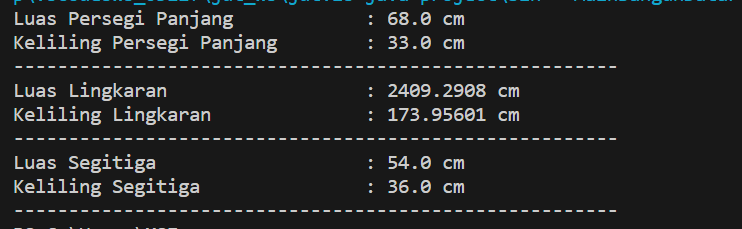

# Tugas Teori Inheritance (Pertemuan 7)

NIM : 2241720139

Nama : Najwa Azzahra

Kelas : TI-2C/20

## Class BangunDatar

```java
public class BangunDatar {

    protected float luas;
    protected float keliling;

    public float luas() {
        return luas;
    }

    public float keliling () {
        return keliling;
    }
}
```

## Class PersegiPanjang

```java

public class PersegiPanjang extends BangunDatar {

    private float panjang;
    private float lebar;

    public PersegiPanjang(float panjang, float lebar) {
        this.panjang=panjang;
        this.lebar=lebar;
    }

    @Override
    public float luas() {
        return panjang * lebar;
    }

    @Override
    public float keliling() {
        return (panjang + lebar) * 2;
    }
}
```

## Class Lingkaran

```java
public class Lingkaran extends BangunDatar{

    private float r;

    public Lingkaran(float r){
        this.r = r;
    }

    @Override
    public float luas(){
        return 3.14f * r * r;
    }

    @Override
    public float keliling(){
        return 3.14f * r * 2;
    }
}
```

## Class Segitiga

```java
public class Segitiga extends BangunDatar{

    //Diasumsikan segitiga siku-siku
    private float alas;
    private float tinggi;

    public Segitiga (float alas, float tinggi) {
        this.tinggi=tinggi;
        this.alas=alas;
    }

    @Override
    public float luas () {
        return alas * tinggi / 2f;
    }

    
    public float sisiMiring () {
        float hipotenusa = (float) Math.sqrt(alas * alas + tinggi * tinggi);
        return hipotenusa;
    }

    @Override
    public float keliling () {
        return alas + tinggi + sisiMiring();
    }

}
```

## Class Main

```java
public class MainBangunDatar {
    public static void main(String[] args) {
        PersegiPanjang pp = new PersegiPanjang(8.5f, 8f);
        System.out.println("Luas Persegi Panjang\t\t: "+pp.luas()+ " cm");
        System.out.println("Keliling Persegi Panjang\t: "+pp.keliling()+ " cm");
        System.out.println("-------------------------------------------------------");

        Lingkaran l = new Lingkaran(27.7f);
        System.out.println("Luas Lingkaran\t\t\t: "+l.luas()+ " cm");
        System.out.println("Keliling Lingkaran\t\t: "+l.keliling()+ " cm");
        System.out.println("-------------------------------------------------------");

        Segitiga s = new Segitiga(9f, 12f);
        System.out.println("Luas Segitiga\t\t\t: "+s.luas()+ " cm");
        System.out.println("Keliling Segitiga\t\t: "+s.keliling()+ " cm");
        System.out.println("-------------------------------------------------------");
    }
}
```

## Output

