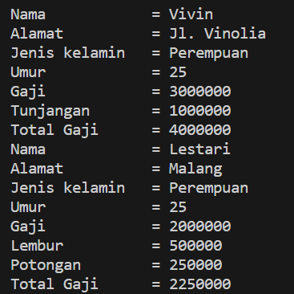
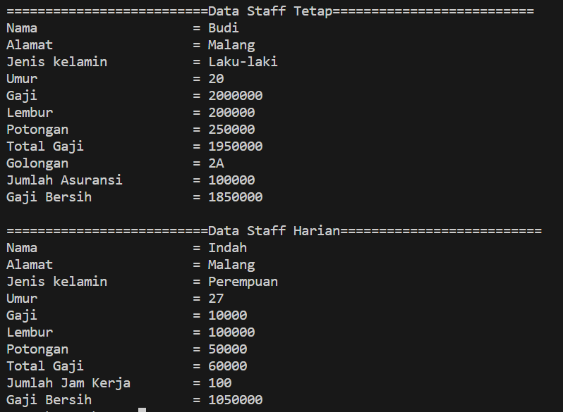
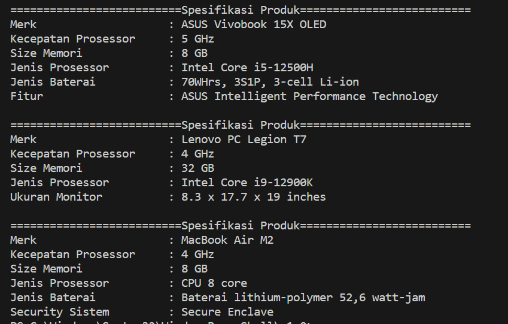

# Jobsheet 6 Inheritance 2

NIM : 2241720139

Nama : Najwa Azzahra

Kelas : TI-2C/20

## Percobaan 1

**Class Karyawan**

```java
package Percobaan1;
public class Karyawan {

    public String nama, alamat, jk;
    public int umur, gaji;

    public Karyawan() {

    }

    public Karyawan (String nama, String alamat, String jk, int umur, int gaji) {
        this.nama=nama;
        this.alamat=alamat;
        this.jk=jk;
        this.umur=umur;
        this.gaji=gaji;
    }

    public void tampilDataKaryawan() {
        System.out.println("Nama\t\t= " +nama);
        System.out.println("Alamat\t\t= " +alamat);
        System.out.println("Jenis kelamin\t= " +jk);
        System.out.println("Umur\t\t= " +umur);
        System.out.println("Gaji\t\t= " +gaji);
    }
}
```

**Class Manager**

```java

package Percobaan1;
public class Manager extends Karyawan{

    public int tunjangan;

    public Manager() {
    }

    public void tampilDataManager() {
        super.tampilDataKaryawan();
        System.out.println("Tunjangan\t= "+tunjangan);
        System.out.println("Total Gaji\t= " +(super.gaji+tunjangan));
    }
}
```

**Class Staff**

```java
package Percobaan1;
public class Staff extends Karyawan {
    public int lembur, potongan;

    public Staff () {

    }

    public Staff (String nama, String alamat, String jk, int umur, int gaji, int lembur, int potongan) {
        super(nama, alamat, jk, umur, gaji);
        this.lembur=lembur;
        this.potongan=potongan;
    }

    public void tampilDataStaff(){
        super.tampilDataKaryawan();
        System.out.println("Lembur\t\t= " +lembur);
        System.out.println("Potongan\t= " +potongan);
        System.out.println("Total Gaji\t= " +(gaji+lembur-potongan));
        
    }
}
```

**Class Inheritance1**

```java
package Percobaan1;

public class inheritance1 {

    public static void main(String[] args) {
        
        Manager M = new Manager();
        M.nama="Vivin";
        M.alamat = "Jl. Vinolia";
        M.umur = 25;
        M.jk="Perempuan";
        M.gaji=3000000;
        M.tunjangan=1000000;
        M.tampilDataManager();

        Staff S = new Staff();
        S.nama="Lestari";
        S.alamat = "Malang";
        S.umur = 25;
        S.jk="Perempuan";
        S.gaji=2000000;
        S.lembur=500000;
        S.potongan=250000;
        S.tampilDataStaff();
    }
}
```

**Output**



### Pertanyaan

1. Sebutkan class mana yang termasuk super class dan sub class dari percobaan 1 diatas!

   **Jawaban**
   
   - Superclass: class Karyawan
   - Subclass: class Staff dan Class Manager

2. Kata kunci apakah yang digunakan untuk menurunkan suatu class ke class yang lain?

   **Jawaban**

   Kata kunci extends yang diikuti dengan nama superclass dan dituliskan setelah deklarasi class

3. Perhatikan kode program pada class Manager, atribut apa saja yang dimiliki oleh class tersebut? Sebutkan atribut mana saja yang diwarisi dari class Karyawan!

   **Jawaban**

   - Atribut class Manager: tunjangan
   - Atribut superclass: alamat, jk, umur dan gaji

4. Jelaskan kata kunci super pada potongan program dibawah ini yang terdapat pada class Manager!

```java 
System.out.println("Total Gaji= "+(super.gaji+tunjangan));
```

   **Jawaban**

   Digunakan untuk memanggil variabel gaji yang terdapat pada superclass kemudian menambahkannya dengan nilai variabel tunjangan yang didefinisikan di class Manager

5. Program pada percobaan 1 diatas termasuk dalam jenis inheritance apa? Jelaskan alasannya!

   **Jawaban**

   Program tersebut termasuk jenis Hierarchical Inheritance, dikarenakan beberapa subclass (class Manager dan class Staff) bergantung pada superclass yang sama (class Karyawan)


## Percobaan 2

**Class Karyawan**

```java
package Percobaan2;
public class Karyawan {

    public String nama, alamat, jk;
    public int umur, gaji;

    public Karyawan() {

    }

    public Karyawan (String nama, String alamat, String jk, int umur, int gaji) {
        this.nama=nama;
        this.alamat=alamat;
        this.jk=jk;
        this.umur=umur;
        this.gaji=gaji;
    }

    public void tampilDataKaryawan() {
        System.out.println("Nama\t\t\t= " +nama);
        System.out.println("Alamat\t\t\t= " +alamat);
        System.out.println("Jenis kelamin\t\t= " +jk);
        System.out.println("Umur\t\t\t= " +umur);
        System.out.println("Gaji\t\t\t= " +gaji);
    }
}
```

**Class Manager**

```java

package Percobaan2;
public class Manager extends Karyawan{

    public int tunjangan;

    public Manager() {
    }

    public void tampilDataManager() {
        super.tampilDataKaryawan();
        System.out.println("Tunjangan\t\t= "+tunjangan);
        System.out.println("Total Gaji\t\t= " +(super.gaji+tunjangan));
    }
}
```

**Class Staff**

```java
package Percobaan2;
public class Staff extends Karyawan {
    public int lembur, potongan;

    public Staff () {

    }

    public Staff (String nama, String alamat, String jk, int umur, int gaji, int lembur, int potongan) {
        super(nama, alamat, jk, umur, gaji);
        this.lembur=lembur;
        this.potongan=potongan;
    }

    public void tampilDataStaff(){
        super.tampilDataKaryawan();
        System.out.println("Lembur\t\t\t= " +lembur);
        System.out.println("Potongan\t\t= " + potongan);
        System.out.println("Total Gaji\t\t= " + (gaji+lembur-potongan));
        
    }
}
```

**Class StaffTetap**

```java
import Percobaan2.Staff;

public class StaffTetap extends Staff {
    public String golongan;
    public int asuransi;

    public StaffTetap() {

    }

    public StaffTetap(String nama, String alamat, String jk, int umur, int gaji, int lembur, int potongan,
            String golongan, int asuransi) {
        super(nama, alamat, jk, umur, gaji, potongan, lembur);
        this.golongan = golongan;
        this.asuransi = asuransi;
    }

    public void tampilStaffTetap() {
        System.out.println("==========================Data Staff Tetap==========================");
        super.tampilDataStaff();
        System.out.println("Golongan\t\t= " + golongan);
        System.out.println("Jumlah Asuransi\t\t= " + asuransi);
        System.out.println("Gaji Bersih\t\t= " + (gaji + lembur - potongan - asuransi));
    }

}
```

**Class StaffHarian**

```java
import Percobaan2.Staff;

public class StaffHarian extends Staff{

    public int jmlJamKerja;

    public StaffHarian() {

    }

    public StaffHarian(String nama, String alamat, String jk, int umur, int gaji, int lembur, int potongan, int jmlJamKerja) {
        super(nama, alamat, jk, umur, gaji, lembur, potongan);
        this.jmlJamKerja=jmlJamKerja;
    }

    public void tampilStaffHarian() {
        System.out.println("==========================Data Staff Harian==========================");
        super.tampilDataStaff();
        System.out.println("Jumlah Jam Kerja\t= " + jmlJamKerja);
        System.out.println("Gaji Bersih\t\t= " + (gaji*jmlJamKerja + lembur - potongan ));
    

    }
}
```


**Class Inheritance1**

```java
public class inheritance1 {

    public static void main(String[] args) {
        
        StaffTetap ST = new StaffTetap ("Budi", "Malang", "Laku-laki",20, 2000000, 250000, 200000, "2A", 100000);
        ST.tampilStaffTetap();

        System.out.println();
        StaffHarian SH = new StaffHarian ("Indah", "Malang", "Perempuan",27, 10000, 100000, 50000, 100);
        SH.tampilStaffHarian();
    }
}
```

**Output**



### Pertanyaan

1. Berdasarkan class diatas manakah yang termasuk single inheritance dan mana yang termasuk multilevel inheritance?

   **Jawaban**
   
   - Single Inheritance: Class Karyawan dan Class Staf

   - Multilevel Inheritance: Class StaffTetap dan Class StaffHarian 

2. Perhatikan kode program class StaffTetap dan StaffHarian, atribut apa saja yang dimiliki oleh class tersebut? Sebutkan atribut mana saja yang diwarisi dari class Staff!

   **Jawaban**

   - Atribut yang diwarisi dari class Staff yaitu atribut lembur dan potongan serta method tampilDataStaff()
   - Atribut StaffTetap golongan dan asuransi
   - Atribut Staffharian jmlJamKerja

3. Apakah fungsi potongan program berikut pada class StaffHarian

```java
super(nama, alamat, jk, umur, gaji, lembur, potongan);
```

   **Jawaban**

   klausa super() bertujuan untuk:
   - Memanggil konstruktor pada superclass agar dapat diakses pada subclass
   - Inisialisasi atribut pada class StaffHarian

4. Apakah fungsi potongan program berikut pada class StaffHarian

```java 
super.tampilDataStaff();
```

   **Jawaban**

   Untuk mengakses method pada class StaffHarian agar dapat dijalankan

5. Perhatikan kode program dibawah ini yang terdapat pada class StaffTetap

```java 
System.out.println("Total Gaji = "+(super.gaji+lembur-potongan-asuransi));
```

Terlihat dipotongan program diatas atribut gaji, lembur dan potongan dapat diakses langsung. Kenapa hal ini bisa terjadi dan bagaimana class StaffTetap memiliki atribut gaji, lembur, dan potongan padahal dalam class tersebut tidak dideklarasikan atribut gaji, lembur, dan potongan?

   **Jawaban**

   karena terdapat deklarasi super() yang dapat menjalankan atribut dari superclass, dimana atribut gaji, lembur dan potongan adalah atribut dari superclass


### Tugas

   **Class Komputer**

   ```java
    public class Komputer {

    public String merk, jnsProsesor;
    public int kecProsesor, sizeMemory;

    public Komputer(){

    }

    public Komputer(String merk, int kecProsesor, int sizeMemory, String jnsProsesor){
        this.merk = merk;
        this.kecProsesor =kecProsesor ;
        this.sizeMemory =sizeMemory ;
        this.jnsProsesor =jnsProsesor ;
    }

    public void tampilData () {
        System.out.println("==========================Spesifikasi Produk==========================");
        System.out.println("Merk\t\t\t: " + merk);
        System.out.println("Kecepatan Prosessor\t: " + kecProsesor+ " GHz");
        System.out.println("Size Memori\t\t: " + sizeMemory + " GB");
        System.out.println("Jenis Prosessor\t\t: " + jnsProsesor);
    }
}
   ```

   **Class Laptop**

   ```java
   public class Laptop extends Komputer {

    public String jnsBaterai;

    public Laptop () {

    }

    public Laptop (String merk, int kecProsesor, int sizeMemory, String jnsProsesor, String jnsBaterai) {
        super(merk, kecProsesor, sizeMemory, jnsProsesor);
        this.jnsBaterai=jnsBaterai;
    }

    public void tampilLaptop () {
        super.tampilData();
        System.out.println("Jenis Baterai\t\t: " + jnsBaterai);
    }
} 
   ```

   **Class Mac**

   ```java
    public class Mac extends Laptop{

    public String security;

    public Mac () {

    }

    public Mac (String merk, int kecProsesor, int sizeMemory, String jnsProsesor, String jnsBaterai, String security) {
        super(merk, kecProsesor, sizeMemory, jnsProsesor, jnsBaterai);
        this.security = security;
    }
    
    public void tampilMac() {
        super.tampilLaptop();
        System.out.println("Security Sistem\t\t: "+ security);
    }
}
   ```

   **Class Windows**

   ```java
    public class Windows extends Laptop{

    public String fitur;

    public Windows () {

    }

    public Windows (String merk, int kecProsesor, int sizeMemory, String jnsProsesor, String jnsBaterai, String fitur) {
        super(merk, kecProsesor, sizeMemory, jnsProsesor, jnsBaterai);
        this.fitur = fitur;
    }
    
    public void tampilWindows() {
        super.tampilLaptop();
        System.out.println("Fitur\t\t\t: "+ fitur);
    }
}
   ```

   **Class Pc**

   ```java
    public class Pc extends Komputer{

    public String ukuranMonitor;

    public Pc () {

    }

    public Pc (String merk, int kecProsesor, int sizeMemory, String jnsProsesor, String ukuranMonitor) {
        super(merk, kecProsesor, sizeMemory, jnsProsesor);
        this.ukuranMonitor=ukuranMonitor;
    }

    public void tampilPc () {
        super.tampilData();
        System.out.println("Ukuran Monitor\t\t: " + ukuranMonitor);
    }
}
   ```

   **Class MainTugas**

   ```java
    public class MainTugas {

    public static void main(String[] args) {

        Windows w = new Windows ("ASUS Vivobook 15X OLED", 5, 8, "Intel Core i5-12500H", "70WHrs, 3S1P, 3-cell Li-ion", "ASUS Intelligent Performance Technology");
        w.tampilWindows();

        System.out.println();
        Pc p = new Pc ("Lenovo PC Legion T7", 4, 32, "Intel Core i9-12900K", "8.3 x 17.7 x 19 inches");
        p.tampilPc();

        System.out.println();
        Mac m = new Mac("MacBook Air M2", 4, 8, "CPU 8 core", "Baterai lithium-polymer 52,6 watt-jam", "Secure Enclave");
        m.tampilMac();
    }
}
   ```

   **Output**

   
