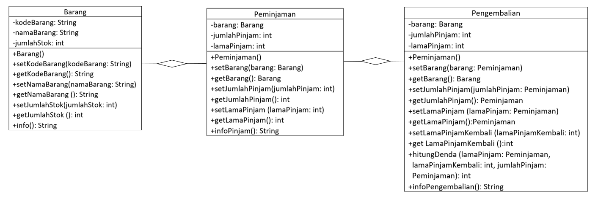

# Quiz 1

NIM : 2241720139

Nama : Najwa Azzahra

Kelas : TI-2C/20

## 1. Class dan Object:

- Apa yang dimaksud dengan "class" dalam pemrograman berorientasi objek?

    **Jawab**

    Class adalah kerangka dasar untuk menampung atribut dan menentukan apa saja yang dapat dilakukan oleh atribut tersebut. Dalam pemograman berbasis objek, class merepresentasikan suatu entitas yang menggabungkan atribut dan method dalam satu unit tunggal. Paradigma ini memungkinkan pemrograman untuk mengorganisasi kode menjadi blok-blok yang lebih kecil dan terstruktur.

- Bagaimana Anda mendefinisikan objek dari suatu class dalam bahasa pemrograman Java?

    **Jawab**

    Objek dalam suatu class dapat dijalankan apabila telah di-inisialisasi pada main untuk dijalankan sebagimana semestinya. cara inisialisasi class adalah 

   ```java 
   namaClass namaObjek = new NamaClass ();
   ``` 

    Parameter dapat diisikan sesuai dengan pendefinisian pada class

- Misalkan Anda memiliki class "Barang" dalam sistem informasi inventaris. Bagaimana Anda akan membuat objek "laptop" dari class tersebut?

    **Jawab**

    Pendefinisian class "Barang" dapat menyesuaikan dengan menggunakan parameter maupun tidak. Pada class main inisialisasi objek "laptop" dengan class "Barang" 
    ```java 
    Barang laptop = new Barang();
    ```

## 2. Encapsulation:

- Jelaskan konsep encapsulation dalam pemrograman berorientasi objek dan mengapa hal ini penting dalam pengembangan sistem informasi inventaris barang.

    **Jawab**

    Enkapsulasi adalah konsep pengikatan data atau metode menjadi satu unit tempat. Dalam pengembangan sistem informasi inventaris barang, encapsulation sangat penting karena dapat membantu melindungi kelas agar tidak mudah diakses sembarangan oleh program lain. Dengan demikian, sistem informasi inventaris barang dapat terlindungi dari akses program lain yang dapat mempengaruhinya. Selain itu, encapsulation juga dapat membantu dalam membuat kode yang lebih mudah dipahami, dipelihara dan diperbaiki.

- Dalam konteks sistem informasi inventaris, sebutkan contoh atribut (variabel) yang
harus di-encapsulate dan mengapa.

    **Jawab**

    - Harga barang: Harga barang adalah data sensitif yang dapat digunakan untuk manipulasi. 
    - Jumlah barang: Jumlah barang harus di-encapsulate agar tidak dapat diubah secara sembarangan. Selain itu juga agar tidak terjadi kesalahan dalam penghitungan jumlah barang pada sistem inventaris
    - Tempat penyimpanan barang: Informasi ini termasuk data sensitif yang dapat digunakan untuk menyembunyikan inventaris perusahaan

## 3. Relasi Kelas:

- Apa yang dimaksud dengan relasi antara kelas dalam pemrograman berorientasi objek?

    **Jawab**

    Relasi antar class menggambarkan bagaimana class tersebut saling berinteraksi dan bekerja sama  untuk mendukung fungsionalitas aplikasi yang dibuat.


- Dalam sistem informasi inventaris barang, bagaimana Anda akan menggambarkan relasi antara kelas "Barang" dan kelas "Kategori"?

    **Jawab**

    Relasi yang sesuai antara class "Barang" dan "Kategori" adalah relasi asosiasi one-to-many dimana satu kategori dapat dimiliki beberapa barang

## 4. PBL:

- Berdasarkan kasus sistem informasi inventaris barang, coba buat sebuah class sederhana beserta atribut dan metodenya yang menggambarkan suatu entitas dalam sistem tersebut (misalnya, class "Barang").

    **Jawab**

    Class Barang

    ```java
    public class Barang {
    private String kodeBarang;
    private String namaBarang;
    private int jumlahStok;

    public Barang() {
    }

    public void setKodeBarang (String kodeBarang) {
        this.kodeBarang = kodeBarang;
    }

    public String getKodeBarang() {
        return kodeBarang;
    }

    public void setNamaBarang (String namaBarang) {
        this.namaBarang = namaBarang;
    }

    public String getNamaBarang() {
        return namaBarang;
    }

    public void setJumlahStok (int jumlahStok) {
        this.jumlahStok = jumlahStok;
    }
    
    public int getJumlahStok() {
        return jumlahStok;
    }

    public String info (){
        String info = "";
        System.out.println("=========Sistem Inventaris Barang PT. Bunga Purnama=========");
        info += "Kode\t: " + kodeBarang + "\n";
        info += "Barang\t: " + namaBarang + "\n";
        info += "Stok\t: " + jumlahStok + "\n";
        return info;
    }
}
    ```

    Class Peminjaman

    ```java
    public class Peminjaman {
    private Barang barang;
    private int jumlahPinjam;
    private int lamaPinjam;


    public Peminjaman() {
    }

    public void setBarang (Barang barang) {
        this.barang = barang;
    }

    public Barang getBarang() {
        return barang;
    }

    public void setJumlahPinjam (int jumlahPinjam) {
        this.jumlahPinjam = jumlahPinjam;
    }

    public int getJumlahPinjam() {
        return jumlahPinjam;
    }

    public void setLamaPinjam (int lamaPinjam) {
        this.lamaPinjam = lamaPinjam;
    }

    public int getLamaPinjam() {
        return lamaPinjam;
    }

    public String infoPinjam (){
        String info = "";
        System.out.println("=========Peminjaman Sistem Inventaris Barang PT. Bunga Purnama=========");
        info += "Barang\t: " + barang + "\n";
        info += "Jumlah\t: " + jumlahPinjam + "\n";
        info += "Durasi\t: " + lamaPinjam + " hari";
        return info;
    }
}
    ```

    Class Pengembalian

    ```java
    public class Pengembalian {
    private Peminjaman barang;
    private peminjaman jumlahPinjam;
    private peminjaman lamaPinjam;
    private int lamaPinjamKembali;

    public Pengembalian () {
    }

    public void setBarang (Peminjaman barang) {
        this.barang = barang;
    }

    public Barang getBarang() {
        return barang;
    }

    public void setJumlahPinjam (peminjaman jumlahPinjam) {
        this.jumlahPinjam = jumlahPinjam;
    }

    public peminjaman getJumlahPinjam() {
        return jumlahPinjam;
    }

    public void setLamaPinjam (peminjaman lamaPinjam) {
        this.lamaPinjam = lamaPinjam;
    }

    public peminjaman getLamaPinjam() {
        return lamaPinjam;
    }

    public void setLamaPinjamKembali (int lamaPinjamKembali) {
        this.lamaPinjamKembali = lamaPinjamKembali;
    }

    public int getLamaPinjamKembali() {
        return lamaPinjamKembali;
    }

    public int hitungDenda (Peminjaman lamaPinjam, int lamaPinjamKembali, peminjaman jumlahPinjam ) {
        int selisihHari=0;
        selisihHari = lamaPinjamKembali - getLamaPinjam();
        if (selisihHari > 0) {
            return selisihHari * 5000 * jumlahPinjam;
        } else {
            return 0;
        }
    }

    public String infoPengembalian (){
        String info = "";
        System.out.println("=========Peminjaman Sistem Inventaris Barang PT. Bunga Purnama=========");
        info += "Barang\t\t: " + barang + "\n";
        info += "Jumlah\t\t: " + jumlahPinjam + "\n";
        info += "Durasi\t\t: " + lamaPinjam + " hari";
        info += "Lama Pinjam\t: " + lamaPinjamKembali + " hari";
        info += "Denda\t\t: " + hitungDenda(barang, lamaPinjamKembali, jumlahPinjam) + " hari";
        return info;
    }
}
    ```
    

- Bagaimana Anda akan menggunakan encapsulation untuk melindungi atribut atribut dalam class tersebut?

    **Jawab**

    Maka atribut akan diakses modifier-nya menjadi privat untuk melindungi atribut atau method dari akses di luar kelas

- Gambarkan hierarki class atau hubungan antar class yang mungkin ada dalam sistem informasi inventaris barang di jurusan Teknologi Informasi. Berikan contoh relasi antar class (misalnya, inheritance atau association) dalam konteks tersebut

   **Jawab**

