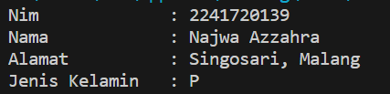
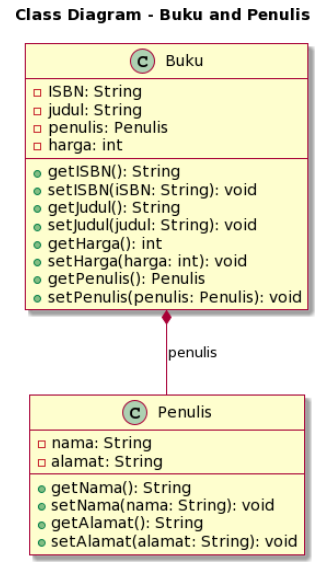
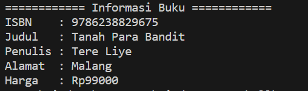

# UTS 1 Object Oriented Programming

NIM : 2241720139

Nama : Najwa Azzahra

Kelas : TI-2C/20

## Soal 1: Penulisan Class

Berdasarkan contoh class ClassA di bawah ini, jelaskan apakah penulisan source code pada contoh class tersebut sudah benar. Jika tidak, apa yang perlu diperbaiki?

```java 
public class ClassA{
    float f1=0.15f;

    float hitung(){
        float x=2f * f1;
    }
}
```

   **Jawaban**

   ```java 
   public class ClassA{
    float f1=0.15f;

    float hitung(){
        float x=2f * f1;
        return x;
      }
}
```

   Terdapat kesalahan dalam penulisan method hitung(). Method hitung() seharusnya menyatakan nilai kembalian (return) karena method tersebut bukan tipe void. 

## Soal 2: Perhitungan Jumlah Elemen Array 2 Dimensi

Pada class SoalArray1, terdapat array 2 dimensi dengan ukuran 3x3. Tuliskan code Java untuk menghitung jumlah total elemen array tersebut dengan menggunakan perulangan.

```java 
public class SoalArray1 {
public static void main(String[] args) {
int[][] arrayInt = {{1, 1, 4}, {2, 1, 2}, {3, 2, 1}};
// hitung jumlah elemen array 2 dimensi
// gunakan perulangan
   }
}
```

   **Jawaban**

   **SoalArray1.java**

   ```java
   public class SoalArray1 {
    public static void main(String[] args) {
        int[][] arrayInt = {{1, 1, 4}, {2, 1, 2}, {3, 2, 1}};
        int totalPenjumlahanElemen = 0; 

        for (int i = 0; i < arrayInt.length; i++) {
            for (int j = 0; j < arrayInt[i].length; j++) {
                totalPenjumlahanElemen += arrayInt[i][j];
            }
        }

        System.out.println("Jumlah Total Elemen Array : " + totalPenjumlahanElemen);
    }
}
   ```

   **Output**

   


## Soal 3: Pewarisan Atribut dan Method

Pada source code yang diberikan, class ClassY merupakan turunan dari class Class. Sebutkan atribut dan method apa saja yang diwarisi oleh ClassY dari kelas induknya (class Class). Jelaskan juga apa output dari code yang ditulis pada class ClassY dan bagaimana nilai tersebut diperoleh.

```java 
public class Class {
   int a = 2;
   int x = 0;

   int hitung() {
      x = x + 5 * a; 
      return x;
   }
}

public class ClassY extends Class { 
   int b = 5;
   int y = 0;

   int hitungY() {
      y = hitung() * b; 
      return y;
}

public static void main(String[] args) { 
   ClassY cy = new ClassY(); 
   System.out.println(cy.hitungY());
   }
}
```

   **Jawaban**

   - Atribut yang diwarisi ClassY = int x
   - Method yang diwarisi ClassY = hitung()
   - Hasil perhitungan cy.hitungY() = 50

   Hasil perhitungan didapatkan pada method ClassY yaitu hitungY() yang menghasilkan nilai y dari  method Class dikalikan b

      -  Method hitung() pada Class
         x = x + 5 * a; 
         x = 0 + 5 * 2
         x = 10

      -  Method hitungY() pada ClassY
         y = hitung() * b; 
         y = 10 * 5
         x = 50
      

## Soal 4: Class Mahasiswa dengan Constructor

Dalam class Mahasiswa, lengkapi code dengan:
- Menambahkan constructor untuk mengisi atribut nim, nama, alamat, dan jenisKelamin.
- Membuat objek mahasiswa dan mengisi atribut nim, nama, alamat, dan jenisKelamin melalui constructor.

```java 
public class Mahasiswa { 
   String nim, nama, alamat; 
   char jenisKelamin;

// a. Tambahkan constructor
// Gunakan constructor untuk
// mengisi atribut nim, nama, alamat, jenisKelamin

public static void main(String[] args) {
// b. Buat objek mahasiswa
// Isi atribut nim, nama, alamat, jenisKelamin
// lewat constructor
   }
}
```

   **Jawaban**

   **Class Mahasiswa**
   ```java 
   public class Mahasiswa {
    String nim, nama, alamat; 
    char jenisKelamin;

    public Mahasiswa () {
    }
    
    public Mahasiswa (String nim, String nama, String alamat, char jenisKelamin) {
        this.nim = nim;
        this.nama = nama;
        this.alamat = alamat;
        this.jenisKelamin = jenisKelamin;
    }
    public static void main(String[] args) {
        
        Mahasiswa m1 = new Mahasiswa("2241720139", "Najwa Azzahra", "Singosari, Malang", 'P');
        System.out.println("Nim\t\t: "+m1.nim);
        System.out.println("Nama\t\t: "+m1.nama);
        System.out.println("Alamat\t\t: "+m1.alamat);
        System.out.println("Jenis Kelamin\t: "+m1.jenisKelamin);
    }
}
   ```


   **Output**

   
 
## Soal 5: OOP Buku -> Penulis

Perhatikan class diagaram berikut dan Buatlah Source code dalam Bahasa java berdasarkan class diagram tersebut

 

   **Class Buku**

```java 
public class Buku {
    private String ISBN;
    private String judul;
    private Penulis penulis;
    private Penulis alamat;

    private int harga;
    
    public void setISBN (String ISBN) {
        this.ISBN = ISBN;
    }

    public String getISBN() {
        return ISBN;
    }

    public void setJudul (String judul) {
        this.judul = judul;
    }

    public String getJudul() {
        return judul;
    }

    public void setPenulis (Penulis penulis) {
        this.penulis = penulis;
    }

    public Penulis getPenulis() {
        return penulis;
    }

    public void setAlamat (Penulis alamat) {
        this.alamat = alamat;
    }

    public Penulis getAlamat() {
        return alamat;
    }

    public void setHarga (int harga) {
        this.harga = harga;
    }

    public int getHarga() {
        return harga;
    }
}
```

   **Class Penulis**

```java 
public class Penulis {
    private String nama;
    private String alamat;

    public void setNama (String nama) {
        this.nama = nama;
    }

    public String getNama() {
        return nama;
    }

    public void setAlamat (String alamat) {
        this.alamat = alamat;
    }

    public String getAlamat() {
        return alamat;
    }

}
```

   **Class Main**

```java
public class Main {

    public static void main(String[] args) {

        Penulis p1 = new Penulis();
        p1.setNama("Tere Liye");
        p1.setAlamat("Malang");
        
        Buku b1 = new Buku();
        b1.setISBN("9786238829675");
        b1.setJudul("Tanah Para Bandit");
        b1.setPenulis(p1);
        b1.setHarga(99000);

        System.out.println("============ Informasi Buku ============");
        System.out.println("ISBN\t: "+b1.getISBN());
        System.out.println("Judul\t: "+b1.getJudul());
        System.out.println("Penulis\t: "+b1.getPenulis().getNama());
        System.out.println("Alamat\t: "+b1.getPenulis().getAlamat());
        System.out.println("Harga\t: Rp"+b1.getHarga());
    }
} 
```

**Output**

   
 